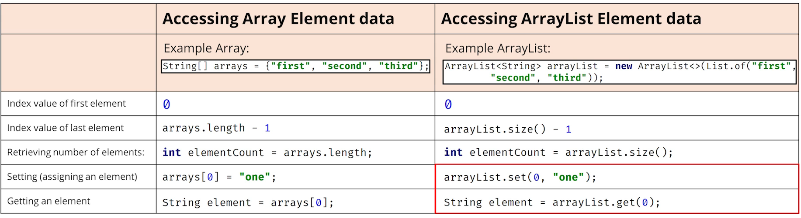

## 135. Arrays vs. ArrayLists: A Practical Comparison

### Arrays vs ArrayLists 

| feature                        | array                        | arraylist |
|--------------------------------|------------------------------|-----------|
| primitive types supported      | yes                          | no        |
| indexed                        | yes                          | yes       |
| ordered by index               | yes                          | yes       |
| duplicates allowed             | yes                          | yes       |
| nulls allowed                  | yes, for non-primitive types | yes       |
| resizable                      | No                           | yes       |
| mutable                        | yes                          | yes       |
| inherits from java.util.Object | yes                          | yes       |
| implements List interface      | No                           | Yes       |   

#### instantiating without values 
##### intantiating arrays : 
```jshelllanguage
string[] array = new String[10];
```
An arrya of 10 elements is created, all with null references. The compiler will only permit Strings to be assigned to the elements 

##### instantiating ArrayLists
````jshelllanguage
ArrayList<String> arrayList = new ArrayList<>();
````
An empty ArrayList is created.  
the ocmpiler will check that only Strings are added to the ArrayList

* the differences when creating a new instance of an array compared to a new instance of an ArrayList
* an array required square brackets in the declaration 
* on the right-hand side of the equals sign, square brackets are also required with a size specified inside 
* An arrayList should be declared with the type of element for the ArrayList in angle brackets 

* use the diamond operator when creating a new instance in a declaration statement 
* you should use a specific type rather than just the Object class because Java can then perform compile-time type checking 

#### Instantiating with values 
```jshelllanguage
String [] array = new String[] {"First", "second", "third"};
```
```jshelllanguage
ArrayList<String> arrayList = new ArrayList<>(List.of("first", "second", "third"));
```

#### Element information 


#### Getting a String representation for Single Dimension Arrays and ArrayLists
```jshelllanguage
System.out.println(Arrays.toString(arrays));
```
```jshelllanguage
System.out.println(arrayList);
```

#### Getting a String representation for Multi Dimension Arrays and ArrayLists
```jshelllanguage
System.out.println(Arrays.deepToString(arrays));
```
```jshelllanguage
ArrayList<ArrayList<String>> multiDList = new ArrayList<>(); 
System.out.println(multiDList);
```

#### Finding an element in an Array or ArrayList
```jshelllanguage
int binarySearch(array, element)
```
* array must be sorted 

```jshelllanguage
boolean contains(element); 
boolean containsAll(list of elements); 
in indexOf(element); 
int lsatIndexOf(element ) ;
```

#### Sorting 
```jshelllanguage
String[] arrays = {"first", "second", "third"};
Arrays.sort(arrays); 
```

```jshelllanguage
import java.util.Comparator;ArrayList<String> arrayList = new ArrayList<>(List.of("first", "second", "third"));
    arrayList.sort((Comparator.naturalOrder()));
    arrayList.sort(Comparator.reverseOrder())
```

#### Array an an ArrayList 
```jshelllanguage
String[] originalArray = new String[] {"first", "Second", "Third"}; 
var originalList = Arrays.asList((originalArray)); 
originalList.set(0, "one");
System.out.println("list: " + originalList);
System.out.println("Array: " + Arrays.toString(originalArray));
```

#### Creating special kinds of lists 
* Array.asList 
  * returned list is not resizable , but mutable 
* Using List.of
  * returned List is IMMUTABLE 

#### Creating Arrays from ArrayList 
```jshelllanguage
ArrayList<String> stringLists = new ArrayList<>(List.of("jan", "feb", "mar")); 
String[] stringArray = stringLists.toArray(new String[0]);
```
