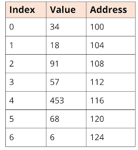
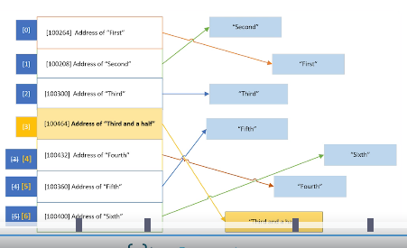
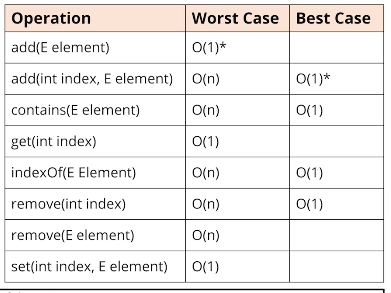
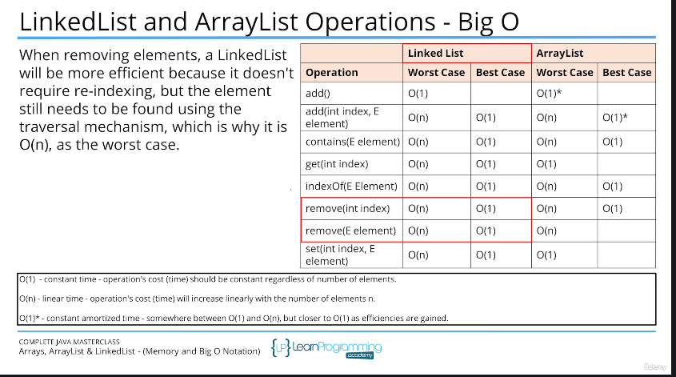

## 137. LinkedList Overview: Memory, Big O, and Why LinkedList Exists

### introduction : 
* in this video will talk about linked list

### Array of primitive values 



#### Arrays and ArrayLists of reference types : 

* this means our objects aren't stored contiguously in memory, but their addresses are, in the array behind the ArrayList. 
* And again, the addresses can be easily retrieved with a bit of math, if we know the index o the element 
* this is **cheap** or fast lookup and doesn't change no matter what size the ArrayList is.
* But to remove an element , the referenced addresses have to be re-indexed or shifted to remove an empty space 
* when adding an element , the arrayList might be too small and might need to be reallocated 

#### ArrayList capacity 
```jshelllanguage
ArrayList<Integer> intList = new ArrayList<>(10); 
for(int i = 0 ; i < 7 ; i++) {
    intList.add((i+ 1) * 5);
}
intList.add(40);
intList.add(45);
intList.add(50); 
```
##### ArrayList capacity is reaced 
* for next operation is going to create a new array , and copy the existing 10 elements 
* adding an element, has constant **amortized** time cost 


#### Big O notation 

#### Constant Amortized Time Cose 
in our case, we'll designate this constant amortized time as O(1)*;  
this means that in the majority of cases, the cost is close to O(1), but at certain intervals, the cost is O(n)  

#### ArrayList Operations  = Big O


#### LinkedList 
* is not indexed at all 
* each element has added to linkedlist has link to the previous element 
* double linked list : the element lined to previous and after elements 
* get element, is expensive in linkedlist 

* inserting, and removing elements is generally considered cheap

#### Big O linked list vs ArrayList


#### which to use ? 
* ArrayList is usually the better default choice for a List, especially if the List is used predominantly for storing and reading data 
* if you know the maximum number of items, then better to use ArrayList , but set it's capacity 
* 