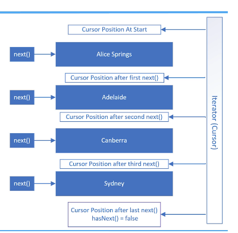
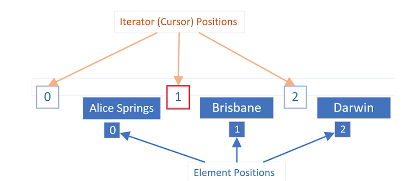

## 140. Iterators Explained: Navigating Lists with Forward & Reverse

### What's an iterator ? 
* in a nutshell it's another way to traverse list 
* mainly used for loops to traverse through elements in an array of list 
* There is the traditional for loop and an index to index into a list 
* and also , the enhanced for loop and a collection to step throught the element one at a time 


#### how does it work ? 
* you might be familiar with a database cursor, which is a mechanism that enables traversal over records in a database 
* an iterator that allows traversal over records in a collection 

* when get an instance of an iterator , you can call the next method to get the next element in the list. 

```java
public static void printItinerrary(LinkedList<String> list) {

    System.out.println("Trip starts at " + list.getFirst()); 
    String previousTown = list.getFirst(); 
    ListIterator<String> iterator = list.listIterator(1); 
    while(iterator.hasNext()) {
        
        var town = iterator.next();
        System.out.println("---> From : " + previousTown + " to " + town);
        previousTown = town; 
        
    }
    System.out.println("The trip ends at " + list.getLast());
}
```

#### How does an Iterator work ? 

* the slie shows visually how an iterator works using the PlacesToVisit List 
* when an iterator is first created , its cursor position is pointed at a position before the first element 
* The first call to the next method retrieves the first element and moves the cursor position to be between the first and second element 
* bussequenct calls to the next method moves the iterator's position through the list , as shown until there are no elements left, meaning hasNext = false ;

#### back to main code ; 
```jshelllanguage
private static void testIterator(LinkedList<String> list) {
    var iterator = list.iterator(); 
    while(iterator.hasNext()) {

        System.out.println(iterator.next());
    }

    System.out.println(list);
}
```

#### remove the duplicates 
```jshelllanguage
private static void testIterator(LinkedList<String> list) {
    var iterator = list.iterator(); 
    while(iterator.hasNext()) {

//        System.out.println(iterator.next());
        if(iterator.next().equals("Brisbane")) {
            iterator.remove(); 
//            list.remove(); 
        }
    }
    

    System.out.println(list);
}
```

#### Iterator vs. ListIterator 
* An iterator is forwards only and only supports the remove methods
* A ListIterator allows you to navigate both forwards and backwards, besides the remove method, it also supports the **add** and **set** methods
```jshelllanguage
private static void testIterator(LinkedList<String> list) {
    var iterator = list.listIterator(); // change to list operator 
    while(iterator.hasNext()) {

//        System.out.println(iterator.next());
        if(iterator.next().equals("Brisbane")) {
            iterator.remove(); 
//            list.remove(); 
            iterator.add("Lake Wivenhoe");
        }
//        while(iterator.hasNext()) {
//            System.out.println(iterator.next());
//        }
        while(iterator.hasPrevious()) {
            System.out.println(iterator.previous());
        }
        
        
    }
    

    System.out.println(list);
}
```

#### Iterator position vs element position 
## 140. Iterators Explained: Navigating Lists with Forward & Reverse
