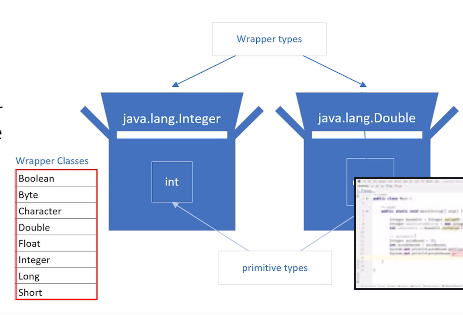

## 143. Introduction to Autoboxing & Unboxing: Moving Between Primitives & Wrappers

### why does java have primitive data types ? 
* some OOP languages don't support primitive languages at all 
* most of popular languages (jave) , supports object oriented 
* primitive has some advantages over objects  
especially as the number of elements you need to store increase
* objects take up **additional** memory and may require little more processing power 


#### Why don't all of Java's collection types support primitives ?
* classes like ArrayList and LinkedList, don't support primitive data types as a collection type 
* in other words **we can't do something** like :  
creating a LinkedList ,using an int primitive type 
* an example the code below won't compile 
```jshelllanguage
LinkedList<int> myIntegers =  new LinkedList<>(); 
```
* we ccan't easily use primitives in some of the feature we'll be learning about in the future, like generics 
* But java, does give us **wrapper classes for each primitive type** 
  * from a primitive to a wrapper : boxing 
  * wrapper to primitive : unboxing 

#### What is Boxing : 

a primitive is boxed or warpped in a containing class, whose main data is the primitive value   
each primitive has a wrapper as shown on the list

#### How do we box ? 
```jshelllanguage
Integer boxedInt = Integer.valueOf(15);
```
* THE CODE IS **manually boxes** 

##### another way of boxing 
```jshelllanguage
Integer boxedInt = new Integer(15); 

```
* this is deprecated code : 
  * means outdated code, and lokely to not be supported in a future version 
  * it is been marked for deletion from the language at some point 

* the **valueOf(int)** is generally better 

#### what is autoboxing 
* java handle the primitive type and convert to wrapper class , without any specification 
```jshelllanguage
Integer boxedInt = 15; 
```

##### unboxing 
```jshelllanguage
Integer boxedInteger = 150; 
int unboxedInt = boxedInteger.intValue(); 
```
* it is not nacessay to do it manually 

##### automatic unbox ;
```jshelllanguage
Integer boxedInteger = 15; 
int unboxedInt = boxedInteger; 
```

#### code examples 
1. create project Autoboxing
```java
public class Main {

    public static void main(String[] args) {
        
        Integer boxedInt = Integer.valueOf(15); // preferred but unncesessary 
        Integer deprecatedBoxing = new Integer(15); 
        int unboxed = boxedInt.intValue(); // unnecessary unboxing 
        
        // automatic 
        Integer autoBoxed = 15; 
        int autoUnboxed = autoBoxed;
        System.out.println(autoBoxed.getClass().getName());
        System.out.println(autoUnboxed.getClass().getName());
        
        Double resultBoxed = getLiteralDoublePremitive(); 
        double resuleUnboxed = getDoubleObject();
    }
    
    private static Double getDoubleObject() {
        
        return Double.valueOf(100.00); 
    }
    
    private static double getLiteralDoublePremitive() {
        
        return 100.00; 
    }
}
```