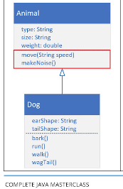

## 151. Diving into Abstract Classes (Part 1): Creating Flexible Hierarchies

### Abstraction 


#### the abstract class : 
```java
abstract class Animal{
    public abstract void move(); 
} 
```
* you can't create **constructor** in abstract class 

* it define the behaviour its subclasses are required to have (inheritance)

```java
class Dog extends Animal {}
```
* Dog is concrete 


#### animal and dog diagram 

* this is concrete class (before knowing abstract) 

#### if animal abstract 
* no concrete methods 
* the subclass provide the concrete methods for any abstract method 

#### the process 
1. create project `AbstractClasses`
2. create class Animal 

```java
public abstract class Animal {
    
    protected String type ; 
    private String size;
            private double weight ; 
            
//            constructor 3 fields 
    
    public abstract void move(String speed); // no default behaviour 
    public abstract void makeNoise(); 
    
}
```
* it is illegal to define abstract method as private 

3. create god Class 
```java
public class Dog extends Animal {
    
    // generate the implemented methods using IntelliJ 
    
    // create constructor to call the super class 
    
    
}
```