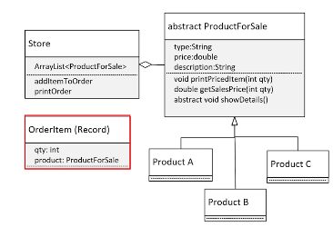

## 154. Abstract Class Challenge (Part 1): Building a Storefront & Product Hierarchy

### introduction 
* build application that can be a store front for **any** imaginable item for sale 
* create **Store** class with a main method 

##### the Store class should: 
* manage **list of products for sale**, including displaying the product datails 
* manage na order, which can just be a **list of OrderItem** objects
* have methods : 
  * add an item to the order 
  * print the ordered items 

##### ProductForSale 
* fields : 
  * type 
  * price 
  * description 
* methods : 
  * getSalesPrice (concrete method):
    * param : quantity 
    * returns : qty * price 
  * printPricedItem (concrete method) : 
    * param : qty 
    * print **itemized line item** with **quantity and line-item price**. 
  * showDetails (abstract) : 
    * display **product type, description price** 

##### OrderItem type 
* has 2 fields (record) : quantity , product for sale 

#### two or three classes 
* extends ProductForSale class 



### the process 
1. create project called `AbstractChallenge`
2. create class `ProductForSale`
```java
public abstract class ProductForSale {

    protected String type;
    protected double price;
    protected String description;

    ProductForSale(String type, double price, String description) {
        this.type = type;
        this.price = price;
        this.description = description;
    }

    public double getSalesPrice(int quantity) {
        return quantity * price;
    }

    public void printPricedItem(int qty) {
        System.out.println("%2d qty at $%8.2f each, %-15s %35s %n");
    }

    public abstract void showDetails();
}

public class ArtObject extends ProductForSale {
    
    // constructor for three elements 
    
    @Overrdie 
    public void showDetails() {
        System.out.println("This " + type + " is beautiful");
        System.out.println("The price of the piece is $%6.2f %n" , price);
        System.out.println(description);
    }
}

public class Store {
    
    
    private static ArrayList<ProductForSale> storeProducts = new ArrayList<>(); 
    
    public static void main(String [] args) {
        storeProducts.add(new ArtObject("Oil painting", 1350, "impressive"));
        storeProducts.add(new ArtObject("pencil painting", 1350, "impressive"));
        
        
        listProducts();
    }
    
    public static void listProducts() {
        
        for(var item : storeProducts) {
            System.out.println("-".repeat(30));
            item.showDetails(); 
            
        }
    }
}
```
