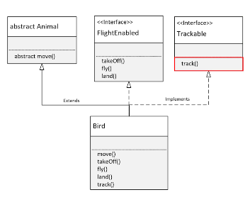
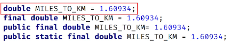

## 157. Interfaces (Part 2): Multiple Implementations & Real-World Examples

### the process 

#### in main method 
* add the following method 
```jshelllanguage
private static void inFlight(FlightEnabled flier) { 
    flier.takeOff(); 
    flier.fly(); 
    if(flier instanceof Trackable tracked) {
        tracked.track(); 
    }
    flier.land(); 
}
```

* call in the main method 

```jshelllanguage
public static void main(String[] args) {
    // .... 
    inFlight(flier); 
}
```

* create class called Jet  
copy and paste the methods from Bird 
```java
public class Jet implements FlightEnabled, Trackable{} 
```
* create another class `Truck` implements Trackable 
```jshelllanguage
Trackable truck = new Truck(); 
truck.track(); 
```

#### the bird class 
* an interface let us treat an instance of a single class as many different types 
* 

#### back to FlightEnabled interface 
* lets add a field : 
```jshelllanguage
double MILES_TO_KM = 1.60934; 
double KE_TO_MILES = 0.621371;
```

#### the final modifier in java 
* we prevent other modificaitons 
* can't be overriden 
* can't be reassigned 
* final static field,  

* once assigned , it can't be changed 

#### constant in java 
* cna't be changed 
* final variable of primitive type, or type String that is initialized with a constant expression 
* usually named with uppercase letters 

#### A field declared on an interface is always public, static and final 


* try on main method 
```jshelllanguage
double kmTraveled = 1000; 
double milesTraveled = kmTraveled * FlightEnabled.KM_TO_MILES;
System.out.println(milesTraveled);
```