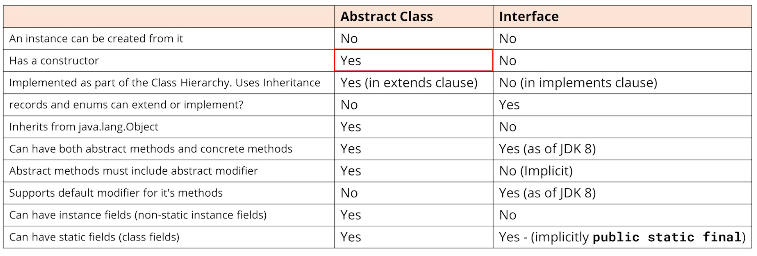

## 161. Interface vs. Abstract Class: Key Differences & Best Use Cases

### abstract class 
* like interfaces can't be instiated 
* can have declared methods both either no body or with body 

### use abstract class when
* share among several closely classes 
* declare non-static or non-final fields 
* to provide a default implementation of certain methods

### interface 
* decleration of methdos 
* is contract between the class and the outside world 
* all methods declared without body 

#### when to use interface 
* unrelated classes will implement it 
* specify the behavior of a particular data type, but not concerned who will implement the behavior 
* seperate different behavior 
* it is used for many features like lambda expressions 
* another example is JDBC

### interface vs abstract class 

