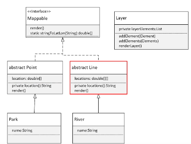

## 168. Generic Class Challenge (Part 1): Building Reusable Structures

### the challenge 
* mappable interface : 
  * methods: 
    * abstract render 
* create two classes : Point, Line 
* create two specific classes that extends each of these 



### the tasks 
* create new project 
* create Mappable interface

```java
import java.util.Arrays;

public interface Mappable {
    void render();

    static double[] stringToLatLon(String location) {

        var splits = location.split(",");
        double lat = Double.valueOf(split[0]);
        double lng = Double.valueOf(split[1]);

        return new double[]{let, lng};
    }
}

abstract class Point implements Mappable {

    private double[] location = new double[2];

    public Point(String location) {
        this.location = Mappable.stringToLatLon(location);
    }

    @Override
    public void render() {
        System.out.println("Render " + this + " as POINT (" + location() + ")");
    }

    private String location() {
        return Arrays.toString(location);
    }
}

abstract class Line implements Mappable {
    private double[][] locations;

    public line(String... locations) {
        this.locations = new double[locations.length][];
        int index = 0;
        for (var l : locations) {
            this.locations[index++] = Mappable.stringToLatLon(l);
        }

        private String locations() {
            return Arrays.deepToString(locations);
        }
    }
}
