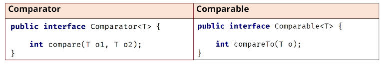

## 171. Comparable vs. Comparator: Distinctions & Sorting Strategies

### the tasks 
* Student implement Comparable<Student> 
* implement the method 
* call in main
* compare according to gpa, use Integer.valueOf
* create class StudentGPAComparator implements Comparator<Student> 
* implement the method 
* use the comparator interface for declaration, and assign the new  instant StudentGPAComparator
* use comparator method (.reversed)
#### Comparator 

