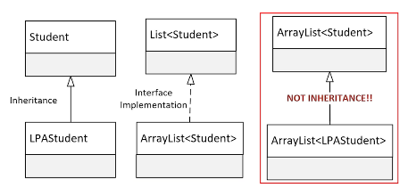

## 172. Generic Classes as Reference Types: Wildcards & Method Parameters

### tasks
1. create GenericExtra project
2. create class student 
   * fields : 
     * string name 
     * string source
     * int yearStarted 
     * protected static Random random = new Random 
     * private static String [] firstNames = {...} 
     * private static String [] courses = {...} 
   * constructor 
     * () 
       * name = random name 
       * course = random course 
       * yearStarted = random year 
     * toString 
       * name, course , year started 
     * methods : 
       * getYearStarted 
3. in main class 
   1. create method printList
      * loop through students 
   2. in main method 
      * int student count - 10 
      * students 
      * loop and add student 
      * call method printList
4. create class LPA student extends Student 
   * fields 
     * double percentComplete ; 
   * constructor ()
     * percentComplete = random 
   * methods 
     * override toString : add percent Complete 
     * getPercentComplete 
5. in main method 
   * create a list of LPA students 
   * print list 
