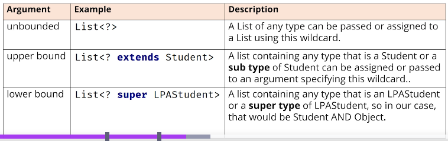

## 173. Generic Methods, Wildcards & Type Erasure: Handling Advanced Cases

#### **limitation** of a **referece** of generic class with a list argument 
* when declaring a variable or method paramter like this : 
```jshelllanguage
printList(List<Student> students) {}
```
* only list subtypes with **Students** can be assigned 
* you can't assign a list of Student subtypes to this!
```jshelllanguage
ArrayList<LPAStudent> students = new ArrayList<>(); 
printList(lpaStudents) ; // this is wrong 
```

#### The solutions 
1. 
```java
    public static <T> void printList(List<T> students) {
        
    }
```

#### Generic methods : 
- generic method can be used for static methods, because static methods can use class type parameters   
    ```java
    class Utils {
        // Generic method inside non-generic class
        public static <T> void printArray(T[] array) {
            for (T item : array) {
                System.out.print(item + " ");
            }
            System.out.println();
        }
    }
    ```
- a generic method can be used in non-generic class 
    ```java
    class Printer {
        // Generic instance method
        public <T> void printItem(T item) {
            System.out.println("Item: " + item);
        }
    }
    ```
- the generic method type parameter is **seperate** from generic class type parameter 
    ```java
    class Box<T> {
        private T value;
    
        public <U> void print(U item) {
            System.out.println("Item: " + item);
        }
    }
    ```

```jshelllanguage
public static <T extends Student> void printStudents(List<T> Students) {
    
    for(var student: students) {
        System.out.print(student.getYearStarted() + " : " + student);
    }
    System.out.println();
}
```
* the upper bound to generic method is Student 
 
```jshelllanguage
public static void printMoreList(List<? extends Student> Students) {
    
    for(var student: students) {
        System.out.print(student.getYearStarted() + " : " + student);
    }
    System.out.println();
}
```

#### ? wild card generic argument 
* cannot be used in intantiation expresison
```jshelllanguage
var myList = new ArrayList<?>(); 
```

#### wild card specify the lower bound and upper bound 
* you can' specify both the upper bound and lower bound at the same declaration 
* 

#### back to main method 
```java
public class Main {

    public static void main(String[] args) {
        
        int studentCount = 10;
        List<Student> students = new ArrayList<>(); 
        for (int i = 0; i < studentCount; i++) {
            students.add(new Student()); 
        }
        printMoreList(students); 
        
        students.add(new LPAStudents()); 
        
        List<LPAStduent> lpaStudents = new ArrayList<>();
        for (int i = 0; i < 10; i++) {
            lpaStudents.add(new LPAStudent()); 
        }
        
        printMoreList(lpaStudents); 
    }
    
    public static void printMoreList(List<? extends Student>students) {
        Student last = students.get(student.size()-1); 
        last.set(0, last); 
        
        for (var s : students) {
            System.out.println("Year started : " + s.getYearStarted() + " Student : " + s);
        }
    }
}
```
* upper bound 
```jshelllanguage
public static void printMoreList(List<? super Student>students) {
    for(var s : students) {
        System.out.println("Year started : " + s.getYearStarted() + " Student : " + s);
    }
}
```

#### Type Erasure 
* the compiler transforms a generic class into a typed class, meaning the byte code or clsas file contains no type parameters 

#### back to main class 
* create new static method : 
  * print list of string
* create new static method : 
  * print list of integer 
* we have error , the two methods are considered the same signature 
* 
```jshelllanguage
public static void testList(List<String> list) {
    
    for(var s : list) {
        System.out.println("This is element of list : " + s.toUpperCase());
    }
}

public static void testList(List<Integer> list) {

    for(var s : list) {
        System.out.println("This is element of list : " + s.floatValue());
    }
}
```
* remove the methods , and create this method 
```jshelllanguage
public static void testList(List<?> list) {
    
    for(var element : list) {
        if(element instanceof String str) {
            System.out.println(str.toUpperCase());
        } 
        if(element instanceof Integer intVal) {
            System.out.println(intVal.floatValue());
        }
    }
}
```