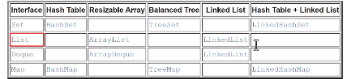
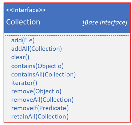
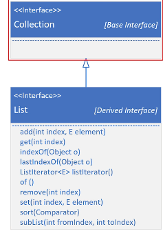
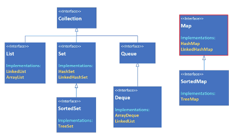
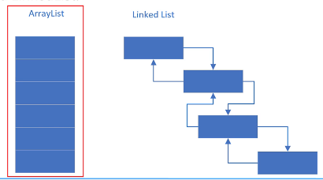
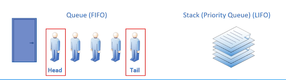
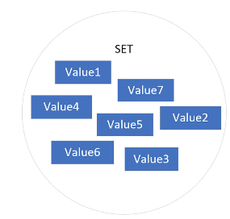
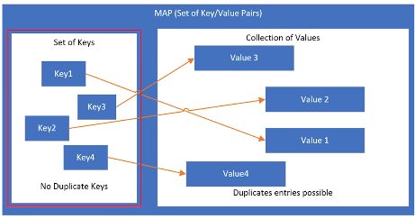

## 198. Deep Dive into Java Collections: Core Interfaces and Big Picture

#### a collection 

#### a collections framework 
* represent, manipulate



#### The collection interface 


#### the code process 
1. create array list (String) 
2. String[] names = ... 
3. list.addAll 
4. print 
```jshelllanguage
List<String> list = new ArrayList<>();
String[] names = {"Mohammad", "Khaled" , "Hasan" , "Faqusa"};
list.addAll(List.of(names));
System.out.println(list);
```
5. add element 
6. add group of elements 
7. use contain 
8. print the list 
9. remove if 
10. print the statement 

11. edit the list declaration type to "Collection" 
12. run the code 
13. edit the list initiation to TreeSet<> 
```jshelllanguage
Collection < String > list = new TreeSet < String > ();
```
#### what is TreeSet ? 
* a collection interface 
* later we talk about 

14. try HashSet init 
    * the elements are not in order 
15. call sort method (sort does not compile)
   * collection interface does not have method sort 


#### the collection interface 


#### Collections - The big picutre : 


#### the list 


#### The queue : 


#### the set 


#### hte map 


#### polymorphic algorithm 
* static methdos : java.util.Collections 
* 