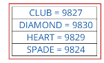
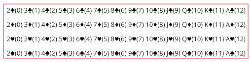

## 199. Creating a Versatile Deck of Cards in Java: Code Setup & Best Practices

#### Card class 
```java

enum Suit {
    CLUB, DIAMOND, HEART, SPADE; 
}
class Card {
    Suit suit; 
    String face; // number card, or face card : JQKA
    int rank; 
    
    @Override 
    String toString() {
        // the value abbreviated, asci character of suit, rank 
        
    }
    
    public static Card(Suit suit, String face) {
        
        return null;
    }
    
    public static Card getNumericCard(Suit suit, int rank) {
        
        return null ;
    }
    public static Card getFaceCard(Suit suit, int rank) {
        return null; 
    }
    
    public static Card[] getStandardDeck() {
        
        return null; 
    }
    
    public void printDeck(String description, Card[] list, int count) {
        // print the Cards out in the number of rows passed 
    }
    
    public void printDeck(Card[] list) {
        printDeck("Current Deck", list, 4);
    }
}
```


