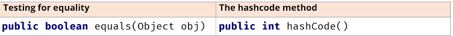
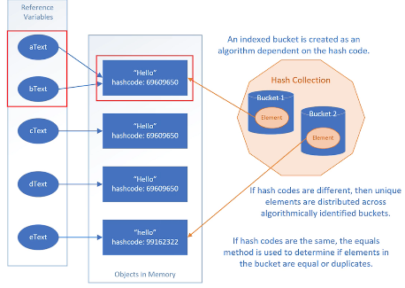

## 205. Java Hash Codes Explained: Mastering the Basics for Effective Collections

### hash set 
* to reduce time searching for an element and eliminate the frequency 
* hash code can be any value of integer 

#### understand the equality 

##### == 
* two variables have the same reference to the object memory 

##### equality of objects : 
* equal if their attributes values are equal 

#### the code process : 
1. create project hashing 
2. in Main class 
3. create 2 variables have same value 
4. create 1 varaible same value using join
5. same value using concat 
6. create List of these variables 
7. print the list elements 
8. create Set of String , passing list of elements 
9. print the set 
10. print the size of the set 
11. loop through elements in set 
    * loop throught the list, and compare == 
12. create playingcard class 
    * String suit 
    * String face 
    * int internalHash 
    * constructor (String suit, String face)
      * internalHash = 1; 
13. create 3 instances of playing card 
14. create list of these instances 
15. create set , assign through loop of list 
16. in PlayingCard : override hashcode and equal methods 
17. equals : 
    * try just return true, 
18. generate the two methods from intellij 
19. 
##### the visual representation of the code 
