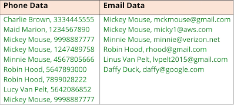

## 206. Preparing for Sets and Maps: Setting Up Phone and Email Contacts in Java

#### The Setup 
* in this example **I'll be using HashSets as fields** and I'll use the Scanner class, which I've used many times before 
* using Scanner with just a String passed to the constructor 
* we'll cover reading input from files 

#### The Setup Challenge - The Contact Class 
* create Contact class 
  * fields : 
    * name : String 
    * emails : HashSet
    * phones : HashSet
  * 4 constructors 
    * name 
    * name email 
    * name phone 
    * name email phone 
      * add email argument if not null to emails set 
      * same for phone (transformed)  
  * methods 
    * mergeContactData , takes a contact and returns new contact

#### The setup challenge  - The Data (ContactData class) 
* emulating gettings data from external source 
* 
* create a method named (getData) 
  * takes string type (phone or email) 
  * returns a list of contact 
* use Scanner to parse the data 
* emulating : 
  * create a contact for each row 
  * return a list 
