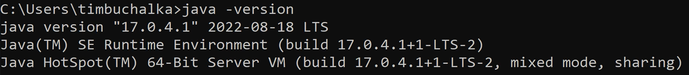
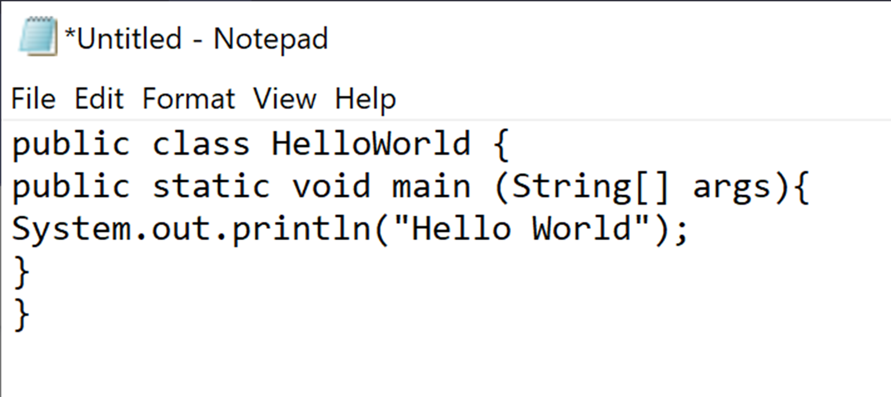
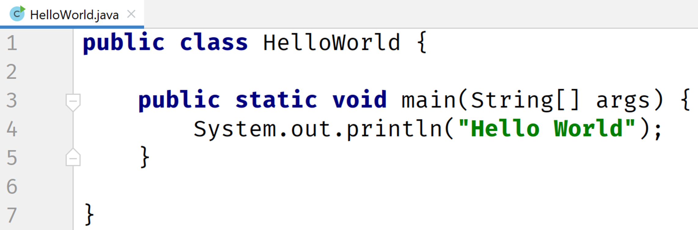

[https://docs.oracle.com/en/java/javase/17/jshell/introduction-jshell.html#GUID-630F27C8-1195-4989-9F6B-2C51D46F52C8](https://docs.oracle.com/en/java/javase/17/jshell/introduction-jshell.html#GUID-630F27C8-1195-4989-9F6B-2C51D46F52C8)

## Confirming installation and intro to JShell
---
Now that we have Java installed on our machines, I want to introduce you to the software tool we'll be using to begin to explore the Java programming language. JShell.

Firstly, let's open a command prompt on Windows, or a Terminal in Mac or Linux, to check our Java version, to make sure we are ready.

On Windows, you can press and hold the Windows key located next to the space bar, and then press the R key.
This will take you to the 'Run' window, where you can type in cmd and hit the enter key.

On a Mac, you can press the Command key and spacebar at the same time, to get to Spotlight, and then type in Terminal.
This should take you to the built in terminal on your Mac.

For Ubuntu Linux, click on 'show applications', in the bottom left of your screen.

Then in the search bar, you can type in Terminal and hit enter.

## Java Version
---

## Code in Notepad
You could use a simple text editor to write Java code.

## IntelliJ IDE
---
Most likely, you'll be using an integrated development environment, or IDE, to develop your Java code.

## JShell
---
#### JShell became a standard component of the Java Developers Kit in Java 9.

It is what is known as a Read-Eval-Print-Loop interactive program (or
REPL for short) which means it does pretty much just that:

- it **reads** the command or code segment we type in.
- it **evaluates** and executes the code, and often allowsshort cuts to be used.
- it **prints** out the results of the evaluation or execution, without making the developer write code to output the results.
- Lastly, it loops right back for more input (more code segments or commands).

JShell runs in a terminal (or on the command line for Windows) and is usefulfor quickly trying out new ideas.

#### JShell does not replace the need for an IDE.
It's just a handy tool to quickly get started with Java. We will be transitioning to an IDE later in the course.

## Where's the Java code?
---
Why did we introduce you to JShell, and not write any Java code? I had a good reason for doing this.

Our first Java code is going to be the very traditional program for a beginner, and we'll do that in the next video.

I wanted to get all the JShell commands and usage out of the way, so in the next video, we can concentrate on just Java code. Remember later in the course we will swing over to an IDE instead of JShell.
