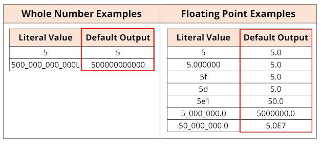

## 23. Understanding Floating-Point Precision: A Practical Challenge in Java


#### Weight converter example : 
[link](https://www.google.com/search?q=200+pounds+in+kg&rlz=1C1PRFI_enPH986PH986&oq=200+pounds+in+kg&aqs=chrome..69i57j0i22i30l9.1482j0j7&sourceid=chrome&ie=UTF-8)

### Floating Point Data Types 
```java
int myIntValue = 5; float myFloatValue = 5f; double myDoubleValue = 5d;
```
```jshelllanguage
jshell> int myIntValue = 5; float myFloatValue = 5; double myDoubleValue = 5;
myIntValue ==> 5
myFloatValue ==> 5.0
myDoubleValue ==> 5.0
```

#### Default output for numeric data types 


* there are more ways to express a decimal real number :  
'f', 'd', 'e<number>' 

#### Division equation JShell 
```java
myIntValue = 5/2;
myFloatValue = 5/2;
myFloatValue = 5f/2f;
myFloatValue = 5f/3f; 
myDoubleValue = 5d/3d; 
myDoubleValue = 5.00/3.00; 
```
```jshelllanguage
jshell> myIntValue = 5/2;
myIntValue ==> 2

jshell> myFloatValue = 5/2;
myFloatValue ==> 2.0

jshell> myFloatValue = 5f/2f;
myFloatValue ==> 2.5

jshell> myFloatValue = 5f/3f;
myFloatValue ==> 1.6666666

jshell> myDoubleValue = 5d/3d;
myDoubleValue ==> 1.6666666666666667

jshell> myDoubleValue = 5.00/3.00;
myDoubleValue ==> 1.6666666666666667
```

#### Why is the double a better choice in most circumstances 
* faster to process on many modern computers  
that is because chip level deal with double faster 
* java libraries math functions , often written to process doubles and not floats , and to return result as a double 
* the creator of Java selected the double becuase it's more precise , and it can handle a larger range of numbers 

#### Challenge 
* convert a given number of pounds to kilograms

Steps 
1. create a varaible with the appropriate type , and store the number in pounds 
2. calculate kilograms , and store it in a variable 
3. print the result 

```java
double pounds = 5.24; 
double kilograms = pounds *  0.453592; 
System.out.println(kilograms);
```

#### Floating Point Number Precision Tips 
In general, float and double are great for general floating point operations 

* **But neither should be used when precise calculations are required**  
this is due to **limitation** of floating point numbers  
java has a class called `BigDecimal` overcome this 

