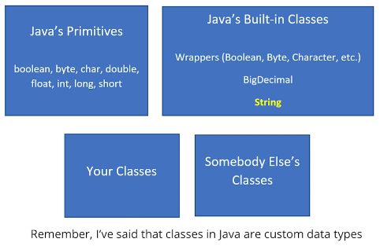

## 25. Recap of Primitive Types and Introduction to the String Class in Java

### Primitive Types recap and the String Data Type 

* in previous video , we have looked to  
char, boolean types, which were Java's seventh and eighth data types 

#### Handling data in java 


##### String 
* is not primitive data type as shown in the figure 
* it is built in java class


#### What is a String 
* a class that contains a sequence of characters 
* ocmpared to char, you are allowed to set jsut one character, in string you can store sequence of characters 

#### String in JShell 

```jshelllanguage
jshell> String myString = "This is a string";
myString ==> "This is a string"

jshell>

jshell> System.out.println("myString is equal to " + myString);
myString is equal to This is a string

jshell>

jshell> myString = myString + ", and this is more";
myString ==> "This is a string, and this is more"

jshell>

jshell> myString = "I wich I had \u00241,000,000.00";

```

* we can use unicode character  
we can use combination of reguler characters and unicode characters 

#### Executing multiple lines of code in JShell 

```jshell

jshell> {
   ...>     String numberString = "250.55";
   ...>     numberString = numberString + "49.2";
   ...>     System.out.println(numberString);
   ...> }
250.5549.2
```
* `250.5549.2` wrong value, because it is not mathematical operation, but string concatenation  
later we will learn how to convert string numbers to numeric types  
* just displayed the value in print command 

#### Executing Multiple Statements in JShell 
* There are two ways to execute multiple statements in JShell: 
  * put your statement on a single line 
  * enclose in `{}`
