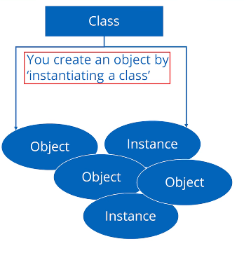

## 70. Understanding Classes, Objects, And Static Versus Instance Members

### the class, the object, static & instance fields and methods

#### in previous video

* local variables: to store and manipulate temporarily data
* in this video: we will describe to use a variable as a part of class or object
* introduce to static methods on the wrapper classes
    * pass strings to numeric values

#### A class

* a custom data type
* a special code block that contains methods

#### the class is a template for creating objects

* class is like an empty form that gets copied and handed out
* object : is like the form once it's been handed out and filed in
* each object will have unique values for the form data being collected

#### An Object

* an object is called an instance of a particular class

#### A class and objects

* you can create an object by `instantiating a class`
* object and instance are interchangeable terms
* you can create many objects using a single class. Each may have unique attributes or values
* 

#### Declaring and instantiating a new object from a Class

* the common way to create an object is to use **new** keyword
* the **new** keyword creates an instance of class,  
  and you can optionally pass data when creating that instance to set up data on that object

##### String

it is actually a class  
but it holds a special place in the java language, because we can **create a String** just by using **a literal which
we've seen**.
`String s = "hello";`

* but we could also use new.

```jshelllanguage
String s = new String("hello"); 
```

#### static and instance fields

| static field                                                                  | instance field                                                                                                                                                                             |
|-------------------------------------------------------------------------------|--------------------------------------------------------------------------------------------------------------------------------------------------------------------------------------------|
| requires 'static' keyword when decalred on the class                          | Omits 'static' keyword when delcared on the class                                                                                                                                          |
| Value of the field is stored in special memory location and only in one place | value of the field is not allocated any memory and has no value until the object is created                                                                                                |
| value is accessed by `ClassName.fieldname` <br/> Example: Integer.MAX_VALUE   | Value is accessed by `ObjectVariable.fieldName` <br/> Example myObject.myFieldName (myObject is our variable name for an object we create and  `myFieldName` is an attribute on  the class |

