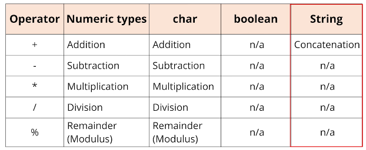

## 71. Parsing Values And Reading Console Input – system.console() Overview

### Parsing values and reading input using System.console()
* we will create application to enter year and birth, and calculate the age 
* when read data from file or user input, it is stored as **String** 

### operators 


### the process 
1. create project named : `ReadingUserInput`

```java
public class Main {

    public static void main(String[] args) {
        
        String currentYear = "2022"; 
        String userDataOfBirth = "1999";

        System.out.println("Age = " + (currentYear - userDataOfBirth)); // this compiles, but concatinated
        
        
    }
}
```

_error_  
```jshelllanguage
        int currentYear = 2022; 
        String userDataOfBirth = "1999";
        System.out.println("Age = " + (currentYear - userDataOfBirth)); // this compiles, but concatinated

        int dateOfBirth = 
```

#### Wrapper methods to parse strings to numeric values 
| wrapper | wrapper method      |
|---------|---------------------|
| Integer | parseInt(String)    |
| Double  | parseDouble(String) |

```jshelllanguage
        int currentYear = 2022; 
        String userDataOfBirth = "1999";
        int dateOfBirth = Integer.parseInt(userDataOfBirth);

        System.out.println("Age = " + (currentYear - dateOfBirth)); // 23

        String userAgeWithPartialYear = "22.5"; 
        double ageWithPartialYear = Double.parseDouble(userAgeWithPartialYear);
        System.out.println(ageWithPartialYear);
```


#### Reading data from the console 
| technique             | description                                                                                                                                                                                              |
|-----------------------|----------------------------------------------------------------------------------------------------------------------------------------------------------------------------------------------------------|
| System.in             | Like System.out, java provies system.in which can read input from the console or terminal. It's not easy to use for beginners, and lots of code has been built around it, to make it easier              |
| System.console        | This is Java's solution for easier support for reading a single line and prompting user for information. Although this is easy to use, it doesn't work with IDE's because these environments disable it. |
| Command Line Argument | This s calling the java program and specifying data in the call, This is very commonly used but doesn't let us create an interactive application in a loop Java.                                         |
| Scanner               | The Scanner class was built to be a common way to read input, either using System.in or a file. For beginners, it's much easier to understand than the bare bones System.in                              |    


#### using scanner class 
```java
public class Main {

    public static void main(String[] args) {
        
        String currentYear = "2022"; 
        String userDataOfBirth = "1999";

        System.out.println("Age = " + (currentYear - userDataOfBirth)); // this compiles, but concatinated

        try{
            System.out.println(getInputFromConsole(currentYear));
            
        } catch (NullPointerException e) {
            System.out.println();
        }
      
        
    }
    
    public static String getInputFromConsole(int currentYear) { // run the method form command line, it is not supported in ide 
        
        String name = System.console().readLine("Hi, What's your Name?");
        System.out.println("Thanks " + name);
        
    }
    
    public static String getInputFromScanner(int currentYear) {
        
        return ""; 
    }
}
```

#### what is an exception 
* error that happens in code
* some types of errors can be predicated and named 

##### catching and exception 
```jshelllanguage
try{
    // statements that might get errors 
} catch(Exception e) {
    // code to 'handle' the exception 
}
```
#### the scanner class 
* simple text scanner 
* we need to create object of scanner 
* use new keyword 

* for user input : 
```jshelllanguage
Scanner sc = new Scanner(System.in); 
```
* for file 
```jshelllanguage
Scanner sc = new Scanner(new File("nameOfFileOnFileSystem"));
```

#### Using the import statement 
`import java.util.Scanner`
* enable auto import on IntelliJ settings 

```jshelllanguage
public static String getInputFromScanner(int currentYear) {
    Scanner scanner = new Scanner(System.in);

    System.out.println("Hi, what is your name ? ");
    String name = scanner.nextLine();

    System.out.println("Hi " + name + ", Thanks for takign the course");

    System.out.println("What year were you born?");

    String dateOfBirth = scanner.nextLine();
    int age = currentYear - Integer.parseInt(dateOfBirth);

    return "So you are " + age + " years old";
}
```