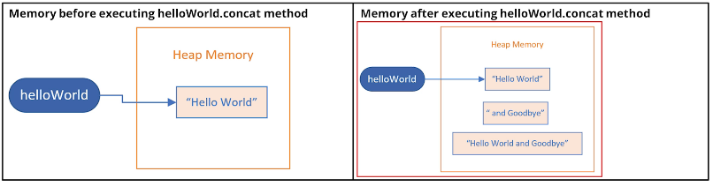
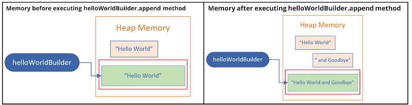

## 100. The StringBuilder: Efficient Mutable Strings

### String vs StringBuilder

* java provides mutable class that let us change its text value 
* this is the StringBuilder class 

#### creating instance 
```jshelllanguage

StringBuilder helloBuilder = new StringBuilder("hello"); 

```
* there are four wasy to creaet a new StringBuilder object using the new keyword 
  * pass a String
  * pass no arguments at all 
  * pass an integer value 
  * pass some other type of character sequence (like StringBuilder)

```java
public class Main {

    public static void main(String[] args) {
        
        String helloWorld = "hello" + "World"; 
        helloWorld.concat(" and GoodBye"); 
        
        
        StringBuilder helloWorldBuilder = new StringBuilder("Hello" + "Wordl");
        helloWorldBuilder.append(" and GoodBye"); 
        printInformation(helloWorld);
        printInformation(helloWorldBuilder);
        
        StirngBuilder emptyStart = new StringBuilder(); 
        StringBuilder emptyStart32 = new StringBuilder(32);

        printInformation(emptyStart);
        printInformation(emptyStart32);
        
        
    }
    
    public static void printInformation(String string) {
        System.out.println("String = " + string);
        System.out.println("Length = " + string.length());
    }
    
    public static void printInformation(StringBuilder builder) {

        System.out.println("StringBuilder = " + builder);
        System.out.println("Length = " + builder.length());
        System.out.println("capacity = " + builder.capacity());
    }
}
```

#### to show that StringBuilder is mutable : 
* concatenation 
```jshelllanguage
helloWorld.concat(" and GoodBye");
helloWorldBuilder.append(" and GoodBye"); 
```

##### String 


* when I passed the String literal , "and Goodbye", to the concat methdo, this created an Object in memory for that literal , " and Goodbye".
* it also created the result of the concat method, the object, the String, that has the value,  
"Hello World and Goodbye"
* these methods don't change the internals of the existing String object
* The String referenced by the helloWorld variable never changed, instead a new String was created by the method call. 

##### StringBuilder 


* on this slide String and StringBuilders in different colors, with the StringBuilder object in green 
* after the call to the append method, I still only have one StringBuilder object
  * this is important, because it means the character sequence is the StringBuilder changed

#### String Methods vs StringBuilder methods 
* String methods create a new object in memory and return a reference to this new object
* StringBuilder methods return a StringBuilder reference, but it's really a self-reference


#### Back to Main code 
```jshelllanguage

    public static void main(String[] args) {
        StirngBuilder emptyStart = new StringBuilder();
        StringBuilder emptyStart32 = new StringBuilder(32);

        printInformation(emptyStart);
        printInformation(emptyStart32);

    }
    public static void printInformation(StringBuilder builder) {

        System.out.println("StringBuilder = " + builder);
        System.out.println("Length = " + builder.length());
        System.out.println("capacity = " + builder.capacity());
    }
```
* capacity : the StringBuilder reserve a capacity before writing the string, for exmaple starting by 16 capacity by default

* using repeat method : 
  * notice the capacity of the one was 16, which is changed to 34, instead of 32 
  * because in case of 32 is not changed, because we didn't require a real allocation , so it still can fit to the current capacity 
```jshelllanguage
StirngBuilder emptyStart = new StringBuilder();
emptyStart.append("a".repeat(17)); 
StringBuilder emptyStart32 = new StringBuilder(32);
emptyStart32.append("a".repeat(17));
    
printInformation(emptyStart);
printInformation(emptyStart32);

```

* by trying to append bigger than the capacity : 
```jshelllanguage
StringBuilder emptyStart32 = new StringBuilder(32);
emptyStart32.append("a".repeat(57));
printInformation(emptyStart32);
```

#### Some methods unique to the StringBuilder class 
* A StringBuilder class has many similar methods to Strings.
* But it also has methods to remove and insert characters or Strings. In addition, you can truncate the string builder's size

| method                  | description                                                                                                        |
|-------------------------|--------------------------------------------------------------------------------------------------------------------|
| delete<br/>deleteCharAt | You can delete a substring using indices to specify a range, or delete a single character at an index              |
| insert                  | you can insert text at a specified position                                                                        |
| reverse                 | you can reverse the order of the characters in the sequence                                                        |
| setLength               | setLength can be used to truncate the sequence, or include null sequences to 'fill out' the sequence to the length |


#### back to Main code
* add the following 
```jshelllanguage

String builderPlus = new StringBuilder("hello" + "World");
helloWorld.concat(" and GoodBye");

builderPlus.replace(16, 17 , "G");
System.out.println(builderPlus);
builderPlus.reverse().setLength(7);
System.out.println(builderPlus);
```