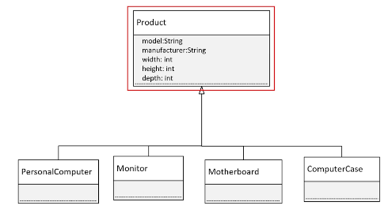
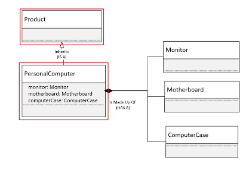
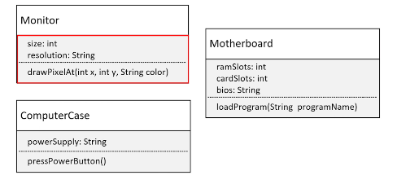

## 102. Building a Computer with Composition: Understanding Has-A vs. Is-A in Java

### Composition 
* Composition is another component in of object-oriented programming 

#### Inheritance 


* then all of the parts have the same base set of attributes, 
* all of these items are products , a particular type of Product

### The process 
1. create a project called `ComputerFactory` 
2. create Main Class 
3. Create Product class 
4. create the subclasses, at the same file
5. add fields to Motherboard 
   * ramSlots
   * cardSlots
   * bios : String
   * full parameters constructors 
   * loadProgram 
6. do the same for other classes as below 
7. create new class `PersonalComputer`, as below 

```java title="Product.java"
public class Product {
    
    private String model; 
    private String manufacturer; 
    private int width; 
    private int height; 
    private int depth; 
    
    public Product(String model, String manufacturer) {
        
        this.model = model; 
        this.manufacturer = manufacturer; 
    }

    public class Monitor extends Product {

        public Monitor(String model, String manufacturer) {
            super(model, manufacturer);

        }
    }


    public class Motherboard extends Product {
        

        public Motherboard(String model, String manufacturer) {
            super(model, manufacturer);
        }
    }

    public class ComputerCase extends Product {

        public ComputerCase(String model, String manufacturer) {
            super(model, manufacturer);
        }
    }
    
}
```

#### Inheritance vs Composition 

Inheritance : is a
Composition : has a 



a Personal Computer, in addition to being product, it actually made up of other parts 

#####  The parts 


#### back to Main code ; 
_motherboard_ 
```java
public class Motherboard extends Product {
    
    private int ramSlots ;
    private int cardSlots; 
    private String bios; 
    
    // constructors (all parameters) 
    
    public Motherboard(String model, String manufacturer) {
        super(model, manufacturer);
    }
}
```

##### monitor clas 
* add fields 
* add function `void drawPixelAt(int x, int y , String color)`
```java

public class Monitor extends Product {
    
    private int size; 
    private String resolution; 
    
    // constructor : all parameters 

    public Monitor(String model, String manufacturer) {
        super(model, manufacturer);

    }
    
    public void drawPixelAt(int x , int y, String color) {
        System.out.println(String.format("Drawing at (%d, %d) with color : %s", x, y , color));
    }
    
}

```

##### computer case class 
* add fields : 
  * powerSupply 
```java
public class ComputerCase extends Product {

    public ComputerCase(String model, String manufacturer) {
        super(model, manufacturer);
    }
    
    public ComputerCase(String model, Stirng manufacturer, String powerSupply) {
        super(model, manufacturer); 
        this.powerSupply = powerSupply; 
    }
    
    public void pressPowerButton () {
        System.out.println("power button pressed");
    }
}


```

##### PersonalComputer class 
```java
public class PersonalComputer extends Prodcut {
    
    private ComputerCase computerCase; 
    private Monitor monitor; 
    private Motherboard motherboard; 
    
    
    // add constructor for all fields IntelliJ 
    
    // add getter methods 
    
    
}
```