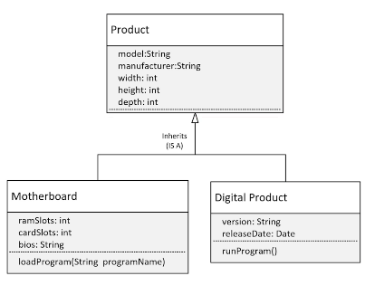
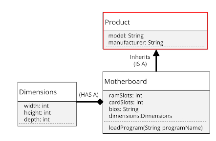

## 103. Assembling a Personal Computer: Real-World Composition and Object Management

### Composition 
* compared to inheritance 
* composition is a way to make the combination of classes act like a single cherent object
* in this video, we need to assemble the `PersonalComputer`


### The process 
Main 
```java
public class Main {

    public static void main(String[] args) {
        
        ComputerCase theCase = new ComputerCase("2208", "Dell", "240");
        Monitor theMonitor = new Monitor("27inch best", "Acer", 27,  "2540 * 1440"); 
        MotherBoard theMotherBoard = new MotherBoard("BJ=200", "Asus", 4 , 6 , "v2.44"); 
        
        PersonalComputer thePc = new PersonalComputer("2208", "DEL", theCase, theMonitor, theMotherBoard); 
        
        
        thePc.getMonitor().drawPixelAt(10, 10, "red"); 
        thePc.getMotherBoard().loadProgram("Windows OS"); 
        thePc.getComputerCase().pressPowerButton();
    }
}
```

#### Composition is creating a whole from different parts 
* we don't access to the parts directly 
* lets comment out the getters methods in `PersonalComputer`

```java
class PersonalComputer {
    
    // .... 
    private Monitor monitor; 
    private ComputerCase computerCase; 
    private MotherBoard motherBoard; 
    
    // constructors 
    
    private void drawLogo() {
        monitor.drawPixelAt(1200, 50, "Yellow");
    }
    
    public void powerUp() {
        computerCase.pressPowerButton(); 
        drawLogo(); 
    }
    
    
}
```

#### Back to Main class 
* comment out the previous methods of getters 
* add `thePc.powerUp()`

#### Use Composition or Inheritance or Both ? 
* look at composition first 

##### Why is Composition preferred over inheritance in many designs 
* more flexible 
* functional reuse , outside of the class hierarchy 
* java inheritance breaks encapsulation, because subclasses may need direct access to a parents state or behaviour 

##### Why Inheritance less flexible? 
* adding a class to or removing a class from a class hierarchy may impact all subclasses from that point 
* new subclasses may not need all the functionality of parent classes 

#### Adding a Digital Product 
* inherits form Product 
* 

#### Revised Class Diagram ;


* this designs allows for future enhancement 
* 