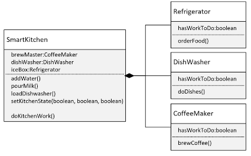

## 104. Hands-On Smart Kitchen Challenge: Modeling IoT Appliances with Composition

### The Composition Challenge 
* in this challenge, you need to create an application for controlling smart kitchen 
* your smart kitchen will have several appliances 
* your appliances will be Internet Of Things (IoT) devices, which can be programmed 


* your job is to enable your smart kitchen application to execute certain jobs 
  * addWAter() : will set Coffee  :  `hasWrokToDo` to true; 
  * pourMilk() : Refrigerator : hasWorkToDo to true 
  * loadDishwasher() : DishWasher : hasWorkToDo to true 
* alternately , you could have as ingle method celled setKitchedState that takes three boolean values, which would set each applicance accordingly 

* to execute the work needed to be done by the appliances , you;ll implement this in two ways : 
  * by using getter and execute method 
    * orderFood() : refrigarator 
    * doDished() : DishWasher 
    * brewCoffee() : CoffeeMaker
  * these methods should check the hasWrokToDo flag, and if ture, print a message out indicating what work is being done
  * Second : your application won't access the appliances directly : 
    * `doKitchenWork()`

```java
public class DishWasher {

    private boolean hasWorkToDo; 
    
    
    public void doDished() {

        hasWorkToDo = true;  
        System.out.println("doing dished right now");
    }
    
}

public class CoffeeMaker {

    private boolean hasWorkToDo;

    public void brewCoffee() {

        hasWorkToDo = true;
        System.out.println("Brewing coffee right now : ... ");
    }
}

public class Refrigerator  {

    private boolean hasWorkToDo;
    
    public void orderFood() {
        
        hasWorkToDo = true;
        System.out.println("Ordering food from the refrigerator");
    }
}

public class Kitchen {
    
    private Refrigerator refrigerator;
    private CoffeeMaker coffeeMaker; 
    private DishWasher dishWasher; 
    
    // constructor 
    public Kitchen( Refrigerator refrigerator,  CoffeeMaker coffeeMaker , DishWasher dishWasher) {
        this.refrigerator = refrigerator; 
        this.coffeeMaker = coffeeMaker; 
        this.dishWasher  = dishWasher; 
    }
    
    // getters 
    
    // one function 
    public void doKitchenWork() {
        refrigerator.orderFood();
        dishWasher.doDished(); 
        coffeeMaker.brewCoffee();
    }
}

public class Main {

    public static void main(String[] args) {

        Kitchen kitchen = new Kitchen(new Refrigerator(), new CoffeeMaker(), new DishWasher());
        
        kitchen.doKitchenWork();
    }
}
```

#### Solution 
1. create project called `CompositionChallege`
2. create `SmartKitchen` class

```java
public class SmartKitchen {

    private Refrigerator refrigerator;
    private CoffeeMaker coffeeMaker;
    private DishWasher dishWasher;
    
}


// 3. create coffee maker class  : 

public class CoffeeMaker {

    private boolean hasWorkToDo;
    
    // setter haswork to do 

    public void brewCoffee() {

        if(hasWorkToDo) {
            System.out.println("Brewing Coffee");
            hasWorkToDo = false; 
        }
    }
}

// 4. copy and paste the coffee maker to refrigerator 

public class Refrigerator {

    private boolean hasWorkToDo;

    // setter haswork to do 

    public void orderFood() {

        if(hasWorkToDo) {
            System.out.println("Ordering food");
            hasWorkToDo = false;
        }
    }
}

// 5. dish washer : 

public class DishWasher {

    private boolean hasWorkToDo;

    // setter haswork to do 

    public void doDishes() {

        if(hasWorkToDo) {
            System.out.println("cleaning dishes");
            hasWorkToDo = false;
        }
    }
}
```
6. back to `SmartKtichen` add constructor (), and initiate its components 
7. generate getters 
```java
public class SmartKitchen {

    private Refrigerator refrigerator;
    private CoffeeMaker coffeeMaker;
    private DishWasher dishWasher;
    
    public SmartKitchen() {
        this.refrigerator = new Refrigerator(); 
        this.dishWasher = new DishWasher(); 
        this.coffeeMaker = new CoffeeMaker();
    }
    
    public void setKitchenState( boolean coffeFlag , boolean refrigeratorFlag, booelan dishWasherFlag){
        coffeeMaker.setHasWorkToDo(coffeFlag);
        refrigerator.setHasWorkToDo(refrigeratorFlag);
        dishWasher.setHasWorkToDo(dishWasherFlag); 
    }
    public void doKitchenWork() {
        refrigerator.orderFood();
        dishWasher.doDished();
        coffeeMaker.brewCoffee();
    }
}
```

in Main method : 
8. create smart kitchen object
9. use getters to reach the components 
10. don't forgot to `setHasWrokToDo` to true 
```java
public class Main {

    public static void main(String[] args) {

        SmartKitchen smartKitchen = new SmartKitchen(); 
      
        // getters 

        kitchen.doKitchenWork();
    }
}
```
