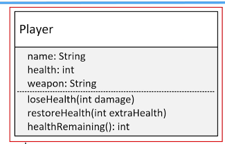

## 105. Encapsulation Essentials, Part 1: Data Hiding and Simplifying Interfaces

### What does Encapsulation mean ? 
* hiding things making them private

#### Whi hide things ? 
* to make the itnerface simpler, we may want to hide unnecessary details 
* to protect the integrity of data on an object, we may hide or restrict access to some of the data and operations 
* to decouple the published interface from the internal detials of the class, we may hide actual names and types of class members 
  * this gives us more flexibility to change the class in the future 

#### Waht od we mean by interface here ? 
* class's public or published interface, which are class members that are exposed to or can be accessed by the calling one 
* every thing else in the class is internal or private to it 
* API is the public contract that tells others how to use the class 

### The process 
1. creat a project called `Encapsulation`
2. create a non-encapsulated class called `Player`
3. 
4. create Player class 
```java
public class Player {
    
//    public String fullName;
    public String name;
    public int health; 
    public String weapon; 
    
    public void loseHealth(int damage) {
        
        health = health - damage; 
        if(health <= 0) {
            System.out.println("Player knocked out of game");
        }
    }
    
    public int healthRemaining() {
        return health; 
    }
    
    public void restoreHealth(int extraHealth) {
        health += extraHealth; 
        if(health > 100){
            System.out.println("Player restored to 100%");
            health  = 100 ;
        }
    }
}

```
5. in Main class, create object of Player 
```java
public class Main {

    public static void main(String[] args) {
        Player player = new Player();
        player.name = "Mohammad";
        player.health = 12;
        player.weapon = "Sword";

        int damage = 10;
        player.loseHealth(damage);
        System.out.println("Remaining health = " + player.healthRemaining());

//        without encapulation 
        player.health = 200; // it didn't call restoreHealth 


        player.loseHealth(11);
        System.out.println("Remaining health = " + player.healthRemaining());
    }
}
```

##### Problem One 
* allowing direct access to data can potentially bypass checks and additional processing 

##### Problem Two
* when changing the name of internal fields , it will affect other classes, 
  * for example player `name` changed to `fullName` 
* allowing direct access to fields means calling code would need to change when you edit any of the fields 

##### Problem Two
* omitting a constructor that would accept initialization data means the calling code **is responsible** for setting up this data on the new object 