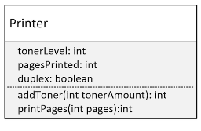

## 107. Encapsulation Challenge: Building a Printer with Toner and Duplex Functionality

### Encapsulation Challenge 


* duplex : double side, or one side 

##### create two methods 
* addToner() 
  * takes tonerAmount argument 
  * should never more 100 percent 
  * if the amount being added makes the level fall outside, return -1 
* printPages() 
  * arg : number of pages 
  * it should take into account duplex 
  * return the number of sheets printed 
  * the sheet number should aslo be added to the pagesPrinted field 
  * if it duplex : should print its a duplex printer 

```java
public class Printer {

    private int tonerLevel ;
    private int pagesPrinted;
    private boolean duplex;


    public Printer(int tonerLevel, boolean duplex) {

        this.pagesPrinted = 0;

        if(tonerLevel < 0 )
            this.tonerLevel = 0;
        else if(tonerLevel > 100)
            this.tonerLevel = 100;
        else
            this.tonerLevel = tonerLevel;

        this.duplex = duplex;
    }

    public int addToner(int tonerAmount) {
        if(tonerAmount < 0)
            return -1;

        int tempAmount = tonerLevel + tonerAmount;
        if(tempAmount > 100 || tempAmount < 0){
            return -1;
        }

        tonerLevel += tonerAmount;
        return tonerLevel;
    }

    public int printPages(int numberOfPages){

        if(numberOfPages < 0)
            return -1;

        int numberOfSheets = duplex ? numberOfPages/2 + (numberOfPages % 2) : numberOfPages;
        pagesPrinted += numberOfSheets;

        return numberOfSheets;
    }

    public int getPagesPrinted() {
        return pagesPrinted;
    }
}
```

Main class : 
```java
public class Main {
    public static void main(String[] args) {

        Printer printer = new Printer(50, true);
        System.out.println("Initial page count : " + printer.getPagesPrinted());

        int pagesPrinted = printer.printPages(5);
        System.out.printf("Current Job Pages: %d, Printer Total: %d %n", pagesPrinted, printer.getPagesPrinted());
    }
}
```