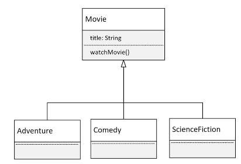

## 108. Polymorphism Foundations, Part 1: Introducing Movie Subclasses for Runtime Varia

### Polymorphism 
* polymorphism allows us to write code that can call a method, but the actual method that gets executed can be different for different objects at runtime 
* this means the behavior that occurs during program execution depends on the runtime type of the object, which might differ from its declared type in the code
* for polymorphism to work, the declared type must have a relationship wit the runtime type, **inheritance is one way to establish this** relationship, where a subclass can override a method from its superclass, enabling polymorphic behavior 
* **there are other mechanisms** to achieve polymorphism , but in this discussion , we'll focus on using inheritance to support polymorphism 

#### Movie Genres 


### The process 
1. create a project called `Polymorphism`
2. create `Movie` class 
3. create `Adveture` class 
```java
public class Movie {
    
    private String title ; 
    
    public Movie(String title){
        this.title = title; 
    }
    
    public void watchMovie() {
        
        String instanceType = this.getClass().getSimpleName(); // to show the used subclass if instantiated  
        System.out.println(title + " is a " + instanceType + " film");
    }
}

class Adventure extends Movie {
    
    public Adventure(String title) {
        super(title); 
    }
    
    // use Intellij override generation 
    @Override 
    public void watchMovie() {
        super.watchMovie();
        System.out.printf("... %s%n".repeat(3), "Please Scene", "Scary Music", "Something Bad Happens");
        
    }
}

class Comedy extends Movie {
    
    public Comedy(String title){
        super(title); 
    }

    @Override
    public void watchMovie() {
        super.watchMovie();
        System.out.printf("... %s%n".repeat(3), "Very funny", "Interesting", "Positive");

    }
}

class ScienceFiction extends Movie {

    public ScienceFiction(String title){
        super(title);
    }

    @Override
    public void watchMovie() {
        super.watchMovie();
        System.out.printf("... %s%n".repeat(3),
                "Bad Aliens do Bad Stuff",
                "Space Guys chase Aliens",
                "Planet Blows Up");

    }
}


public class Main {

    public static void main(String[] args) {
        
//        Movie theMovie = new Movie("Star Wars"); 
//        theMovie.watchMovie();
        
        Movie theMovie = new Adventure("Start Wars ");
        theMovie.watchMovie(); // notice the decided method to run in runtime
        
    }
}
```
* the behavior was the Adventure behavior : 
```jshelllanguage
Movie theMovie = new Adventure("Start Wars ");
theMovie.watchMovie(); // notice the decided method to run in runtime 
        
```