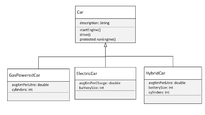

## 112. Polymorphism Challenge: Building Gas, Electric, and Hybrid Car Classes in Java

### Polymorphism Challenge 


* the methods in car should be public, but the `runEngine` should be protected
* requirement : 
  * create the structure 
  * implement the methods in subclasses appropiatly 


### the process 
1. create car class

```java
public class Car {

    private String description;

    public Car(String description) {
        this.description = description;
    }

    public void startEngine() {

        System.out.println("Car -> startEngine");
    }

    protected void runEngine() {

        System.out.println("Car -> runEngine");
    }

    public void drive() {
        System.out.println("Car -> driving, type is " + getClass().getSimpleName());
        runEngine();
    }
}

class GasPoweredCar extends Car {

    private double avgKmPerLiter;
    private int cylinders;

    public GasPoweredCar(String description) {
        super(description);
    }

    public GasPoweredCar(String description, double avgKmPerLiter, int cylinders) {
        super(description);
        this.avgKmPerLiter = avgKmPerLiter;
        this.cylinders = cylinders;
    }

    @Override
    public void startEngine() {
        System.out.println("Gas -> All %d cylinders are fired up, Ready! %n", cylinders);
    }

    @Override
    protected void runEngine() {
        System.out.println("Gas -> usage exceeds the average: %.2f %n", avgKmPerLiter);
    }
    
}

public class Main {

    public static void main(String[] args) {
        Car car = new Car("20222 blue Farrari 296 GTS");
        runRace(car);

        Car ferrari = new GasPoweredCar("Farreri Car Super Sonic", 15.4, 6);
        runRace(ferrari);
    }

    public static void runRace(Car car) {
        car.startEngine();
        car.drive();
    }
}
```
* run the application 
  * the runtime type of ferrari is carpoweredcar 
* override methods (ctrl + o); 
  * startEngine() 
  * runEngine() 

