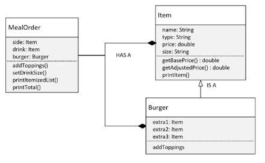

## 115. OOP Master Challenge, Part 2: Implementing Meal Orders and Pricing Strategies

#### the design : 


### the code 

#### Burger 
```java
public class Burger extends Item {
    
    private Item extra1; 
    private Item extra2; 
    private Item extra3; 
    
    public Burger(String name, double price) {
        super("Burger", name, price);
    }
    
    @Override 
    public getName() {
        return name + " Burger"; 
    }
    
    @Override 
    public getAdjustedPrice() {
        return getBasePrice() +
                ((extra1 != null) ? extra1.getAdjustedPrice() : 0) +
                ((extra2 != null) ? extra2.getAdjustedPrice() : 0) +
                ((extra3 != null) ? extra3.getAdjustedPrice() : 0);
    }
    
    public double getExtraPrice(String toppingName) {
        
        return switch(toppingName.toLowerCase()) {
            case "AVOCADO", "CHEESE"-> 1.0; 
            case "BACON", "HAN", "SALAMI" -> 1.5;
            default -> 0; 
        }; 
    }
    
    public void addToppings(String extra1, String extra2, String extra3) {
        this.extra1 = new Item("Topping", extra1, getExtraPrice(extra1));
        this.extra2 = new Item("Topping", extra2, getExtraPrice(extra1));
        this.extra3 = new Item("Topping", extra3, getExtraPrice(extra1));
    }
    
    public void printItemizedList() {
        
        printItem("BASE BURGER", getBasePrice());
        if(extra1 != null) extra1.printItem();
        if(extra2 != null) extra2.printItem();
        if(extra3 != null) extra3.printItem();
    }
    
    @Override 
    public void printItem() {
        printItemizedList();
        System.out.println("-".repeat(30));
        super.printItem();
    }
}
```

#### Main class 
```java
public class Main {

    public static void main(String[] args) {
        
        Burger burger = new Burger("Cheese Burger", 10.0);
        burger.addToppings("CHEESE", "BACON", "HAN");
        burger.printItem(); 
    }
}
```

#### MealOrder 
```java
public class MealOrder {
    private Burger burger; 
    private Item drink; 
    private Item side; 
    
    public MealOrder() {
        this("regular", "coke", "fries"); 
    }
    public MealOrder(String burgerType, String drinkType, String sideType) {
        
        this.burger = new Burger(burgerType, 4.0);
        this.drink = new Item("Drink", drinkType, 1.0);
        this.side = new Item("Side", sideType, 1.5);
    }
    
    public double getTotalPrice() {
        return burger.getAdjustedPrice() + drink.getAdjustedPrice() + side.getAdjustedPrice();
    }
    
    public void printItemizedList() {
        burger.printItem(); 
        drink.printItem(); 
        side.printItem();
        System.out.println("-".repeat(30));
        Item.printItem("Total Price", getTotalPrice());
    }
    
    public void addBurgerToppings(String extra1, String extra2, String extra3) {
        burger.addToppings(extra1, extra2, extra3);
    }
    
    public void setDrinkSize(String size) {
        drink.setSize(size); 
    }
}
```

#### Main class 
```java
public class Main {

    public static void main(String[] args) {
        
        MealOrder order = new MealOrder();
        order.addBurgerToppings("CHEESE", "BACON", "HAN");
        order.setDrinkSize("small");
        order.printItemizedList();
        
        MealOrder mealOrder = new MealOrder("turkey", "coke", "fries");
        mealOrder.addBurgerToppings("CHEESE", "BACON", "HAN");
        mealOrder.setDrinkSize("small");
        mealOrder.printItemizedList();
    }
}
```