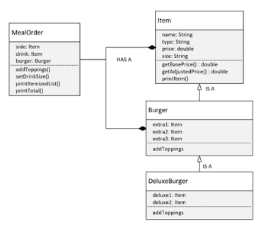

## 116. OOP Master Challenge: Deluxe Burger Bonus Adding Specialized Topping and Pricing


### the code 

#### DeluxeBurger.java
```java
public class DeluxeBurger extends Burger {
    
    Item deluxe1; 
    Item deluxe2; 
    
    public DeluxeBurger(String name, double price) { 
        super(name, price);
    }
    
    @Override 
    public void addTopping(String extra1, String extra2, String extra3){
        super.addTopping(extra1, extra2, extra3);
        deluxe1 = new Item("Topping", extra1, 0);
        deluxe2 = new Item("Topping", extra1, 0);
    }
    
    @Override 
    public double getExtraPrice() {
        return 0.0; 
    }
    
    @Override 
    public void printItemizedList() {
        super.printItemizedList();
        if(deluxe1 != null)
            deluxe1.printItem();
        if(deluxe2 != null)
            deluxe2.printItem();
    }
    
}
```

#### MealOrder 

```java
public class MealOrder {
    
    public MealOrder(String burgerType, String drinkType, String sideType) {
        this.burger = burgerType;
        
        if(burgerType.equalsIgnoreCase("deluxe"))
            this.burger = new DeluxeBurger(burgerType, 8.5);
        else 
            this.burger = new Burger(burgerType, 4);
        this.drink = new Item("Drink", drinkType, 1);
        this.side = new Item("Side", sideType, 1.5);
    }
    
    public double getTotalPrice() {
        if(burger instanceof DeluxeBurger)
            return burger.getAdjustedPrice();
        
        return side.getAdjustedPrice() + drink.getAdjustedPrice() + burger.getAdjustedPrice();
    }
    
    public void printOrder() {
        burger.printItem();
        drink.printItem();
        side.printItem();
        System.out.println("Total Price: " + getTotalPrice());;
    }
    
    public void printItemizedList() {
        
        burger.printItem(); 
        if(burger instanceof DeluxeBurger ) {
            Item.printItem(drink.getName(), 0); 
            Item.printItem(side.getName(), 0); 
        } else {
            drink.printItem(); 
            side.printItem();
        }
        System.out.println("-".repeat(30));
        Item.printItem("Total", getTotalPrice());
    }
    
    public void addBurgerToppings(String extra1, String extra2, String extra3, extra4, extra5) {
        if(burger instanceof DeluxeBurger db )
            db.addTopping(extra1, extra2, extra3, extra4, extra5);
        else 
            burger.addTopping(extra1, extra2, extra3);
    }
}
```

```java
public class Main {

    public static void main(String[] args) {
        
        MealOrder order = new MealOrder("deluxe", "coke", "chicken");
        order.addBurgerToppings("cheese", "pepperoni", "onion", "avocado", "salami");
        order.setDrinkSize("SMALL"); 
        order.printItemizedList(); 
    }
}
```