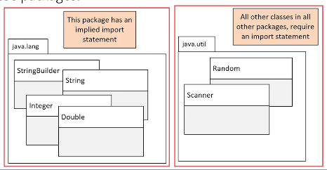
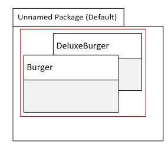

## 117. Project Structure and Modular Design: Harnessing Packages and Import Statements

### Organizing Java Classes 
* previously we had mention packages when importing some classes like Scanner

### Package
As per the oracle java documentation 
* A pckage is a namespace that organizes a set of related types 
* in general, a package corresponds to a folder or directory on the operatin system, but this isn't requirement
* when using an IDE like IntelliJ, we don't have to worrry about how packages and classes are stored on the file system 

* package structure is hierarchical , meaning you group types in a tree-like fashion 
* you can use any legal java identifier for you package names, but common practice has package names **in all lowercase**
* the period separates the hierarchical levels of the package 

#### Java packages 


#### Using classes from packages other than java.lang = the import statement 
* you may remember , when we used the Scanner and Random classes, we were required to use an import statement
```java
import java.util.Scanner;
public class Main {
    public static void main(String[] args) {
        Scanner scanner = new Scanner(System.in);
    }   
}
```
* the import statement should be declared : 
  * after the package declaration 
  * before any other declarations in the class

#### Multiple import statements : 
* there is no limit 


#### Using import statements with wildcards
```java
import java.util.*;
```
* I telling java to import all classes from the java.util package 

#### What is the purpose of packages ? 
* let us reuse common class names across different libraries or applications and provice a way to identify the correct class 
  * either with an import  statement 
  * or a qualifying name 
* for example you migh have a package for utility classes that can provide common functionality for all of your classes to access 

* packages let us organized our classes by functionality or relationships 
* packages also let us encapsulate our classes form classes in other packages 

### What would a package name look like ? 
* we've seen that Java starts their packages names **with java** in osme of the examples we've looked at
* However, it is common practice to use the **reverse domain** name to start your own package naming convention 
* if your company is `abccompancy.com`, for example, your package prefixed would be `com.abccompany`
  * for the rest of the course, I'll be using `dev.lpa` the learning domain of the course
* The package name hierarchy is seperated by periods 

#### using the package statment 
* the package statement needs to be the first statement in the code,  
with the exception of comments and whitespace 
* the package statement comes before any import statements 
* there can be only one package statement because a class or type can **only be in a single package** 

#### The fully Qualified Class Name(FQCN)
* A class's fully qualified class name (FQCN) consists of the package name and the class name 

```java
package dev.lpa.package_one;
import java.util.*; 

public class Main {
    public static void main(String[] args) {
        
        Scanner scanner = new Scanner(System.in);
        Random random = new Random();
    }
}
```
* it is unlikely , with its fully qualified name, will have a naming conflict with a Main class in another package 
* As another example, the fully qualified class name of the Scanner class in this code is `java.util.Scanner`

#### Fully Qualifed Class Nmae vs the import statement 
```java
package dev.pla.package_one; 

public class Main {

    public static void main(String[] args) {
        java.util.Scanner scanner = new java.util.Scanner(System.in); 
    }
}
```

#### Using the package statement 

* if we don't specify the package statement, 
  * will **implicitly** placed by default 
* for your application , **you should** always specify a package statement and avoid using the default or unnamed package 
  * the main disadvantage :  
  that you can't import types from the default package , into other outside classes  
  in other words, you can't qualify the name if it's in the default package, and you can't import classes from the default package

### The process 
1. create new project called `Packages`
2. create new package, by right click on `src`, named : `dev.lpa`
3. click on gear -> on tree appearance , **uncheck compact middle packages** 
4. create new Java class `Main`

```java
package dev.lpa;
public class Main {
    
}
```
5. create another class  `com.abc.first.Item`
   * created three package folders
   * created class Item 
```java
package com.abc.first; 

public class Item {
    private String type; 
    
    public Item(String type) {
        this.type = type; 
    }
    
    @Override 
    public String toString() {
        return "Item{" +
                "type=" + type +
                '}';
    }
}
```

6. back to Main class 
```java
package dev.lpa;
import com.abc.first.Item;
public class Main {

    public static void main(String[] args) {
        Item firstItem = new Item("Burger"); // the intellij will suggest by displaying the class package path, and when click, it will automatically improt 
        com.abc.first.Item secondClass = new com.abc.first.Item("Burger");
        
        System.out.println(firstItem);
    }
}
```