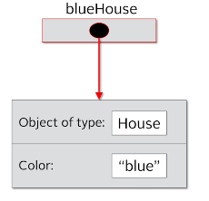
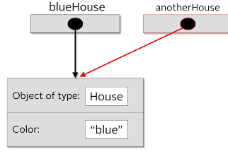
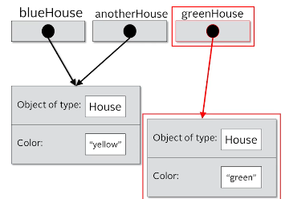
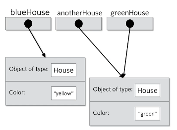

## 84. Understanding References, Objects, and Instances

### Reference vs object vs instance vs class 

#### object vs instance vs class 
* exmaple of building house 
* blue print : class 
* house we build: instance , using new operator, 
* each house has and address : reference 

```jshelllanguage
House blueHouse = new House("blue");
```

```jshelllanguage
House anotherHouse = house; 
```


```jshelllanguage
house greenHouse = new House("green"); 
```


```jshelllanguage
anotherHouse = greenHouse; 
```


### The reference vs The object 
```java
new House("red");
House myHouse = new House("beige"); 

House redHouse = new House("red");

new House("red"); 
```
* in first line, we created an object, but not assigned to a variable
  * this compiles file 
  * but can't access it later 
  * becasue we didn't create a reference to it 
* the third line has no relationship to the second line 