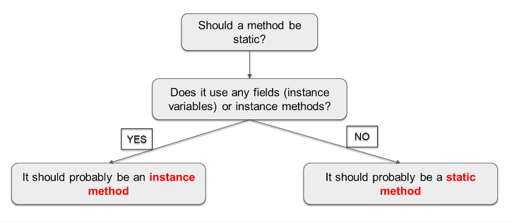

## 86. Static vs. Instance Methods Explained

### Static vs. Instance Methods 

#### Static methods 
* can't access instant methods directly 
* usually for operations that odn't require any data from an instance of the class (from "this")
* inside `static` method we can't use **this**

```java
import java.util.Calendar;

class Calculator {

    public static void printSum(int a, int b) {
        System.out.println("sum = " + (a + b));
    }
}

public class Main {

    public static void main(String[] args) {
        Calculator.printSum(5, 10);
        printHello();
    }
    
    public static void printHello() {
        System.out.println("hello");
    }
}
```

#### Instance methods 
* can access static and instance methods 
* can access static and instance methods

#### Instance method example 
```java
class Dog {
    
    public void bark() {
        System.out.println("woof");
    }
}

public class Main{

    public static void main(String[] args) {
        Dog rex = new Dog();
        rex.bark(); 
    }
}
```

#### instance or method ? 
