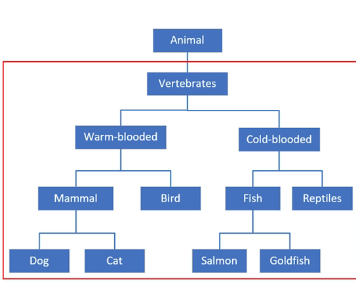
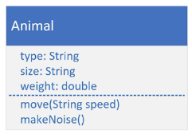
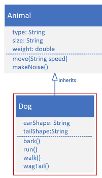

## 89. Inheritance - Part 1: The Basics

### Inheritance 
* we can look it as a form of code reuse 
* it is a way to organize classes into a parent-child hierarchy, which lets the child inherit (reuse), fields and methods from its parent 

#### Animal Kingdom Example 

* the most generic starts from the top 
* everyclass below is subclass

### the process 
1. create a project called inheritance 

#### The animal class 

* a class diagram allows us to design our classes before we build them 
* it has two parts, fields and methods 

2. create animal class 
```java
public class Animal{
    
    private String type;
    private String size; 
    private double weight; 
    
    // constructors 
    
    // getters setters 
    
    // behaviours 
    
    public void move(String speed){
        System.out.println(type + " moves " + speed );
    }
    
    public void makeNoise(){
        System.out.println(type + "makes noise ");
    }
}
```
3. create the dog class: 

* inherit the Animal class using keyword `extends`
```java
public class Dog extends Animal {
    
    public Dog() {
        super(); // calling parent constructor : Animal 
    }
}
```
* this will compile error if we did not declare `constructor` for `Dog` to call the explicit constructor in `Animal`

#### super ()
* is a lot like this()
* to call the constructor on the super class from the subclass 
* like `this()`, it has to be the first statement of the constructor 
  * for this rule, `this` and `super` can never ba called from the same constructor 

```java
public class Main {

    public static void main(String[] args) {
        Animal animal = new Animal("Generic Animal", "Huge", 400); 
        doAnimalStuff(animal, "slow");
        
        Dog dog = new Dog(); 
        doAnimalStuff(dog, "fast");
    }
    
    public static void doAnimalStuff(Animal animal, String speed) {
        
        animal.makeNoise(); 
        animal.move(speed);
        System.out.println(animal);
        System.out.println("______");
        
    }
}
```