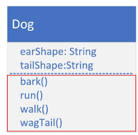

## 90. Inheritance - Part 2: Extending Animal Class

### Inheritance in Java

#### in previous video 
* extend keyword
* super()
* create Dog as subclass of Animal 

#### in this video 
* create a Dog and makes it different and unique 

#### The Dog class 


```java
public class Dog {
    
    private String earShape; 
    private String tailShape; 
    
    public Dog() {
        super("Mutt", "Big", 400);
    }
    
    public Dog(String type, double weight) {
        
        super(type,weight < 15 ? "small" : (weight < 35 ? "medium" : "large"), weight); 
        this.earShape = "around"; 
        this.tailShape = "around"; 
    }
    
    // constructor with all parameters 
    
    public Dog(String type, double weight, String earShape, String tailShape) {
        
        super(type, weight < 15 ? "small" : (weight < 35 ? "medium" : "large"), weight); 
        this.earShape = earShape; 
        this.tailShape = tailShape;
    }
    
    // toString { "" + super.toString} 
    
}

public class Main{

    public static void main(String[] args) {
        
        Dog yorkie = new Dog("yorkie", 30); 
        
        
    }
}
```

#### Code re-use 
* all subclasses can execute emthdos even though teh code is declared on the parent class 
* the code doesn't have to be duplicated 
* we can use code form the parent 
* or change it in subclass 

#### Overriding a method 
* when you create a method on a subclass, which has the same signature as a method on a super class 
* if you want to show different behaviour 
* you can create it manually or auto generated IntelliJ IDE 
* can do one of three things : 
  * it can implement completely different behaviour, overriding the behaviour of the parent 
  * simply call the parent class's method, which is somewhat redundant to do
  * or the method call the parent class's method and include other code to run extend the functionality for the Dog, for that behavior 


* for example we create a method in dog class , inherited from Animal class 
```jshelllanguage
@Override 
public void move (String speed) {
    
    super.move(speed);
    System.out.println("Dogs walk, run and wag their tail" );
}
```