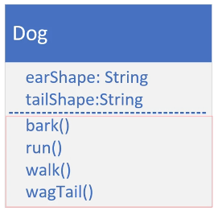
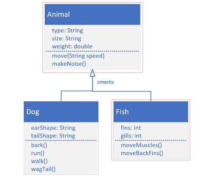

## 91. Inheritance - Part 3: Unique Dog & Fish Classes

#### class diagram for dog animal 


#### code Dog from previous video 

```java
public class Dog extends Animal {
    
    private String earShape; 
    private String tailShape; 
    
    public Dog() {
        super("Mutt", "Big", 400);
    }
    
    public Dog(String type, double weight) {
        
        super(type,weight < 15 ? "small" : (weight < 35 ? "medium" : "large"), weight); 
        this.earShape = "around"; 
        this.tailShape = "around"; 
    }
    
    // constructor with all parameters 
    
    public Dog(String type, double weight, String earShape, String tailShape) {
        
        super(type, weight < 15 ? "small" : (weight < 35 ? "medium" : "large"), weight); 
        this.earShape = earShape; 
        this.tailShape = tailShape;
    }
    
    // toString { "" + super.toString} 


    public void makeNoise() {
        bark();
        System.out.println("making noise" );
    }
    
    public void bark() {
        System.out.println("The dog is barking");
    }

    public void run() {
        System.out.println("running");
    }

    public void walk() {
        System.out.println("walking");
    }

    public void wegTail(){
        System.out.println("wegging");

    }
    
}


public class Main{

    public static void main(String[] args) {
        
        Dog yorkie = new Dog("yorkie", 30); 
        
        
    }
}
```
* lets create another method in dog , `bark`
* lets create another method in dog , `run`
* lets create another method in dog , `walk`
* lets create another method in dog , `wegTail`

```jshelllanguage
public void bark() {
    System.out.println("The dog is barking");
}

public void run() {
    System.out.println("running");
}

public void walk() {
    System.out.println("walking");
}

public void wegTail(){
    System.out.println("wegging");
    
}

```

* configure `makeNoise` to call bark
```jshelllanguage
public void makeNoise() {
    if(type == "World") { // make type is protected access in animal, t
        
    }
    bark();
    System.out.println("making noise" );
}
```  
change the type access in parent class ,   
```jshelllanguage
public class Animal {
    protected String type; 
    // .... 
}
```

#### The class diagram with additional class, Fish 


```java
public class Fish extends Animal{

    private int gills;
    private int fins;

    public Fish(String type, double weight, int gills, int fins) {
        super(type, "small", weight);
        this.gills = gills;
        this.fins = fins;
    }

    private void moveMuscles() {
        System.out.println("muscles moving");
    }

    private void moveBackFin() {
        System.out.println("backfin moving");
    }

    @Override
    public void move(String speed) {
        super.move(speed);
        moveMuscles();
        if(speed == "fast") {
            moveBackFin();
        }
        System.out.println();
    }

    @Override
    public String toString() {
        return "Fish{" +
                "gills=" + gills +
                ", fins=" + fins +
                '}';
    }
}

```
##### In main class 

```jshelllanguage
public static void main(String[] args) {
    Fish goldie = new Fish("GoldFish", 0.25, 2, 3);
    goldie.doAnimalStuff();
}
```

### Polymorphism 
* is simply means "many forms"
* advantages 
  * it makes code simpler 
  * it encourages code extensibility 
  * 