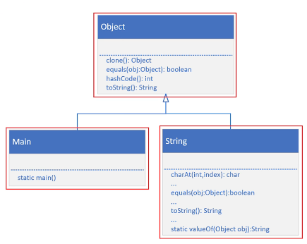
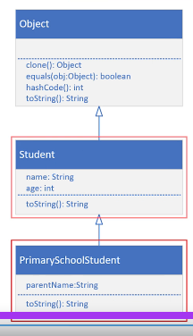

## 92. Unveiling java.lang.Object in Java

### Inheritance 


#### java.lang.Object
* every java class you create , it actually extends from this class `Object`
* see what java has to say about this class : 
  * we'll use the link to Java's Application Programming Interface(API) for this class, which you can find in the resources section oof this video 
  * [as following link ](https://docs.oracle.com/en/java/javase/17/docs/api/java.base/java/lang/Object.html)
  * you can select the method tab, to display methods 

#### IntelliJ code 
in main class : 
```java 
// auto generate from Object class 

public class Main extends Object {

    public static void main(String[] args) {
        
    }
}

class Student {
    private String name; 
    private int age; 
    
    // constructor , all fields 
    
    
}

```

#### Every class inherits from Object 

* main class inherits from Object class 
* The String class has over 60 methods 
* the String class overrides several methdos on Object, two of thich are equals() and toString()

#### back to code process 
* right click on Object , go to , declarations user 
  * it displayes the course code of object 
  * we see a list of methods 
  * one of these methods (hashcode)
    * integer unique to the instance 

* if you override toString in class, and when print the class , 
  * it will call the overridden toString, not the one from Object class 

#### Class Diagram for Student and PrimarySchoolStudent 


```java
class PrimarySchoolStudent extends Student{
    
    String parentName; 
    
    public PrimarySchoolStudent(String name, int age, String parentName) {
        surper(name, age); 
        this.parentName = parentName; 
    }
    
    @Override
    public String toString(){
        return parentName + "'s kid, " + super.toString(); 
    }
}
```

* will compile error 
```jshelllanguage
class PrimarySchoolStudent extends Student, Object {}
```
* the inheritance tree is cumulative 
* meaning the primary school student inherits both student members and object members 
* Object memebers are accessible , as long as student doesn't override them 
* because Student overrides `toString`
