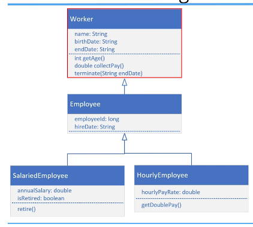

## 93. Inheritance Challenge - Designing a Worker Hierarchy

### Inheritance Challenge 

#### Class diagram 


Your challenge is : 
* create worker class 
* employee class 
* and either the SalariedEmployee or the HourlyEmployee 
* create the attributes and methods shown in diagram 
* create Main method that create either SalariedEmployee or HourlyEmployee 
  * SalariedEmployee : retire() 
  * HourlyEmployee: doublePlay()

### the code 

```java
public class Worker {

    private String name;
    private String birthDate;
    private String endDate;
    
    public Worker() {
        
    }

    public Worker(String name, String birthDate, String endDate) {
        this.name = name;
        this.birthDate = birthDate;
        this.endDate = endDate;
    }

    public int getAge() {
        return 2025 - Integer.parseInt(birthDate.substring(6));
    }

    public double collectPay() {
        return 0.0;
    }

    public void terminate(String endDate) {
        this.endDate = endDate;
    }

    @Override
    public String toString() {
        return "Worker{" +
                "name='" + name + '\'' +
                ", birthDate='" + birthDate + '\'' +
                ", endDate='" + endDate + '\'' +
                '}';
    }
}
```

```java

public class Employee extends Worker{
    private long employeeId;
    private String hireDate;
    private static long employeeNo = 1; 

    public Employee(String name, String birthDate, String hireDate) {
        super(name, birthDate);
        this.employeeId = Employee.employeeNo++;
        this.hireDate = hireDate;
    }

    @Override
    public String toString() {
        return "Employee{" +
                "employeeId=" + employeeId +
                ", hireDate='" + hireDate + '\'' +
                "} " + super.toString();
    }
}
```

```java
public class HourlyEmployee extends Employee {

    private double hourlyPayRate;

    public HourlyEmployee(String name, String birthDate, long employeeId) {
        super(name, birthDate, employeeId);
        this.hourlyPayRate = hourlyPayRate;
    }

    public void getDoublePay(){
        hourlyPayRate *= 1.2;
    }
}

```

```java
public class SalariedEmployee extends Employee {

    private double annualSalary;
    private boolean isRetired;

    public SalariedEmployee(String name, String birthDate, String endDate, long employeeId, String hireDate, double annualSalary, boolean isRetired) {
        super(name, birthDate, endDate, employeeId, hireDate);
        this.annualSalary = annualSalary;
        this.isRetired = isRetired;
    }

    public void retire(){
        isRetired = true;
    }
}

```

```java
public class Main {

    public static void main(String[] args) {
        HourlyEmployee hourlyEmployee = new HourlyEmployee("mohammad", "30/05/2002", 4);

        hourlyEmployee.getDoublePay();

        System.out.println(hourlyEmployee);
    }


}

```

