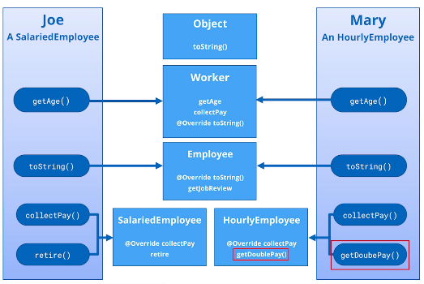

## 94. Inheritance Challenge Part 2: Specialized Employees
```java
public class HourlyEmployee extends Employee {

    private double hourlyPayRate;

    public HourlyEmployee(String name, String birthDate, long employeeId) {
        super(name, birthDate, employeeId);
        this.hourlyPayRate = hourlyPayRate;
    }

    public void getDoublePay(){
        return 2 * collectPay(); 
    }
    
    @Override 
    public double collectPay() {
        return 40 * hourlyPayRate; 
    }
}

```

```java
public class SalariedEmployee extends Employee {

    private double annualSalary;
    private boolean isRetired;

    public SalariedEmployee(String name, String birthDate, String endDate, long employeeId, String hireDate, double annualSalary, boolean isRetired) {
        super(name, birthDate, endDate, employeeId, hireDate);
        this.annualSalary = annualSalary;
        this.isRetired = isRetired;
    }
    
    @Override 
    public double collectPay() {
        double payCheck = annualSalary / 26; 
        double adjustedPay = (isRetired) ? 0.9 * payCheck : payCheck;
        
        return (int) adjustedPay;
    }

    public void retire(){
        terminate("12/12/2025");
        isRetired = true;
    }
}

```

