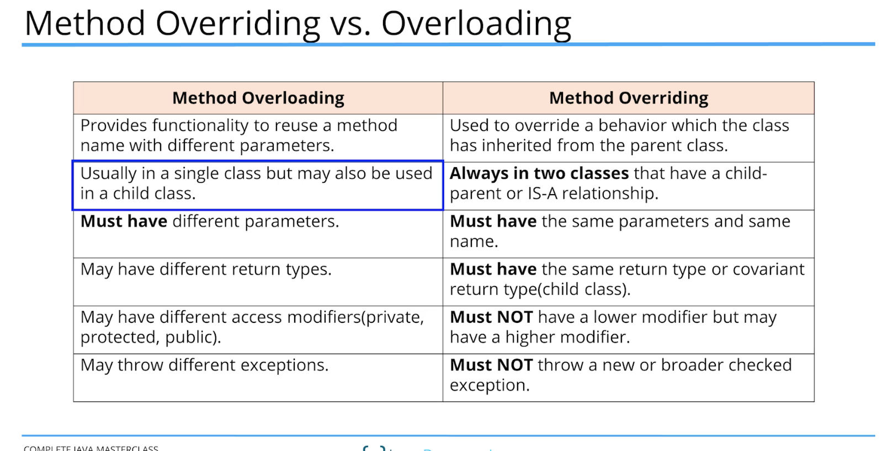

## method overloading vs method overriding

we can overload static or instance metods

Java developers often refere to method **overloading as** compile-time polymorphism

while **method overloading** is runtime polymorphism

