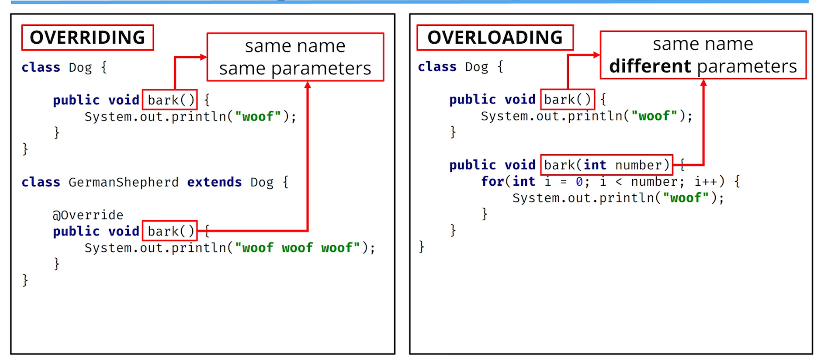

## 96. Method Overloading vs. Overriding Explained

### Method Overloading 
* means providing two or more separate methods in a class with the same name but different parameters 
* method return type may or may not be different, and that allows us to reuse the same method name 
* **Overloading** is very handy, it reduces duplicated code, and we con't have to remember multiple method names 
* we can overload **static** or **instance methods**

* to the code calling an overloaded method, it looks like a single method be called with different sets of arguments 
* java developers often refer to method overloading, as compile-time polymorphism
* this means the compiler is determining the right method to call, based on the methdo name and argument list

* usually **overloading** happens within a single class 
* but methods can also be overloaded by subclasses 
* that is because the **subclass** inherits one version of the method from the parent class, and then the subclass can have another overloaded version of that method 

##### Method Overloading Rules 
* methods must have the same method name 
* methods must have different parameters

if following the rules above : 
* they may or may not have different return types 
* they may or may not have different access modifiers 
* they may or may not throw different checked or unchecked exceptions 

#### Method Overriding 
* method overriding means defining a method in a child class that already exists in the parent class, with the same signature (the **same name** , **same parameters**).
* By extending the parent class, the child class gets all the methods defined in nthe parent class, Those methods are also known as **derived methods** 
* **Method Overriding** is also known as **Runtime polymorphism** or **Dynamic Method Dispatch** because the methdo that is going to be called is decided at runtime by the Java virtual machine 

* when we **override** a method, it's recommended to put @Override immediately above the method definition 
* The `@Overrdie` statement is not required, but it's a way to get the compiler to flag an error if you don't actually properly override this method 
* We'll get an error if we don't follow the overriding rules correctly 
* We can't override static methods, **only instance methods** can be overridden 

##### Method Overriding Rules 
A method will be considered overridden if we follow these rules:
* it must have the same name and same arguments 
* the return type can be a subclass of the return type in the parent class 
* It can't have a lower access modifier. In other words, it can't have more restrictive access privileges 
* for example : if the parent's method is protected, then **using private is the child's overridden method is not allowed**. However, using public for the child's method would be allowed, in this example 

There's also some important points about method overriding to keep in mind : 
* Only **inherited methods** can be overridden, in other words, methods can be overridden only in child classes 
* constructors and private methods cannot be overridden 
* Methods that are final cannot be overridden 


### Method Overriding vs. Overloading 


| method overloading                                                      | method overriding                                                               |
|-------------------------------------------------------------------------|---------------------------------------------------------------------------------|
| provides functionality to reuse a method name with different parameters | used to override a behavior which the class has inherited from the parent class |
| Usually in a single class but may also be used in a child class         | **always is two classes** that have a child-parent or IS-A relationship         |
| **Must have** different parameters                                      | Must have the same parameters and same name                                     |
| May have different return types                                         | Must have the same return type or coveriant return type(child class)            |
| May have different access modifiers(private, protected, public)         | **Must Not** have a lower modifier but may have a higher modifier               |
| May throw different exceptions                                          | **Must NOT** throw a new or broader checked exception                           |

#### Covariant Return Type 
* the return type of an overridden method can be the same type as the parent method's declaration 
* but it can also be a subclass. 
* The term, covariant return type, is more appropriate 

* as mentioned previously, there's a clone method on the class `Object` that all classes inherit from 
```jshelllanguage
protected Object clone() throws CloneNotSupportedException{}
```
* if yo uverrode this method by using Intellij's code generation tools, it would generate this code in your class : 
```jshelllanguage
@Override 
protected Object clone() throws CloneNotSupportedException{
    return super.clone(); 
}
```
* when you;re cloning an instance, you're going to want to return an Object that's the same type as the Object you are cloning 

* here is method Override for person class 
```java
public class Person {
    
    @Override 
    public Person clone() {
        return new Person(name, birthDate); 
    }
}
```