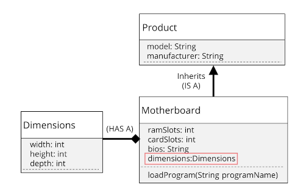

## Composition

## why composition is preferred over inheritance

is more flexible - you can add or remove parts, with less downstream effect

functional reuse outside the class hierarchy

Inheritance breaks encapsulation becuase sublasses may need direct access to parents's state or behavior

