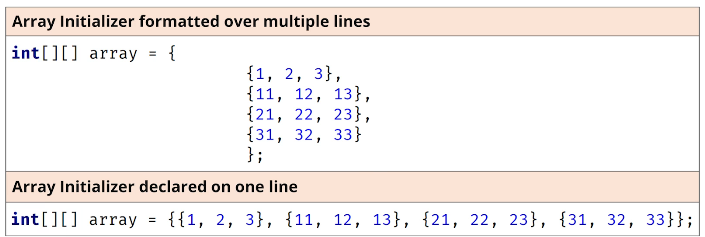

## 129. Navigating 2D Arrays: Matrix Representation and Nested Loop Traversals

### Java's nested Arrays 



* it does not have to be uniformed matrix 

#### initialize two dimensional array 
```jshelllanguage
int[][] array = new int[3][3]; 
int[][] array = new int[3][]; // array of three null elements 
```

* other ways : 
```jshelllanguage
int[] myDoubleArray[];
```

### the process code ; 
```java
public class Main {

    public static void main(String[] args) {

        int[][] array2 = new int[4][4];
        System.out.println(Arrays.toString(array2));
        System.out.println("array2.length = " + array2.length);

        for (int[] outer : array2) {
            System.out.println(Arrays.toString(outer));
        }

//        for(int i = 0 ; i < array2.length ; i++) {
//            var innerArray = array2[i];
//            for(int j = 0; j < innerArray.length ; j++) {
//                System.out.println(array2[i][j] + " ");
//            }
//            }

        for (var outer : array2) {
            for (var element : outer) {
                System.out.println(element + " ");
            }
        }

        System.out.println(Array.deepToString(array2));
    }

}
```

#### accessing multidimentional array 
```jshelllanguage
for (int j = 0; j < innerArray.length; j++) {
    System.out.println(array2[i][j] + " ");
}
```

##### more readable : 
```jshelllanguage
for (var outer : array2) {
    for (var element : outer) {
        System.out.println(element + " ");
    }
}
```
##### using 1 method 
```jshelllanguage
System.out.println(Array.deepToString(array2));
```

#### but when modifieng the multi dimentional array : 
```jshelllanguage
for (int j = 0; j < innerArray.length; j++) {
    array2[i][j] = 10 * i + 2 * j ; 
    System.out.println(array2[i][j] + " ");
}
```